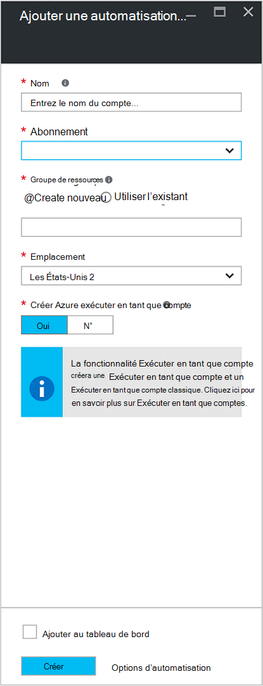
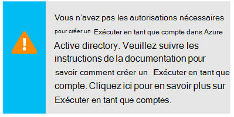
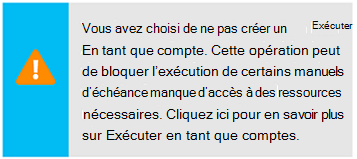
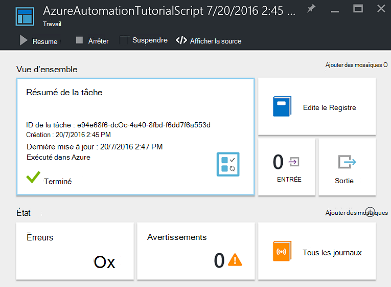
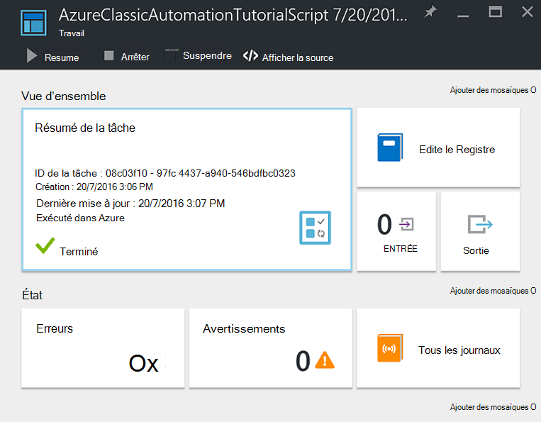
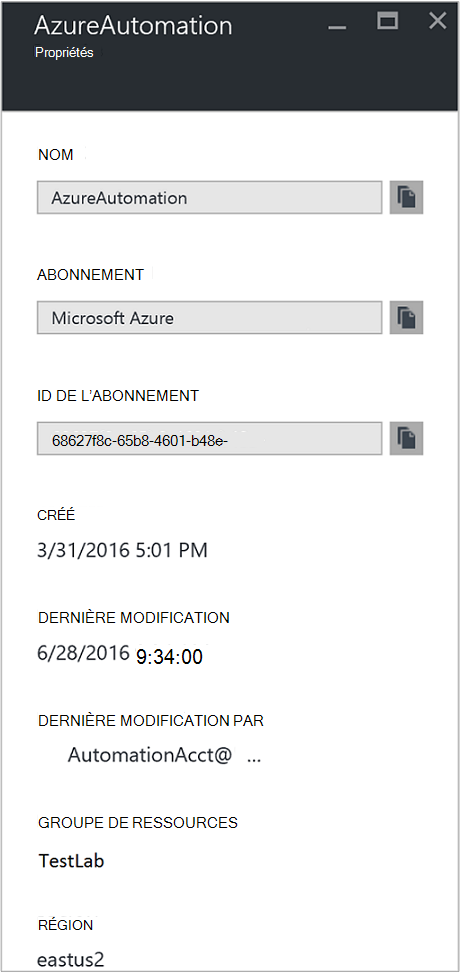

<properties
    pageTitle="Configurer Azure exécuter en tant que compte | Microsoft Azure"
    description="Didacticiel qui vous guide dans l’utilisation de création, de test et exemple principal d’authentification de sécurité dans Azure Automation."
    services="automation"
    documentationCenter=""
    authors="mgoedtel"
    manager="jwhit"
    editor=""
    keywords="nom principal de service, setspn, authentification azure"/>
<tags
    ms.service="automation"
    ms.workload="tbd"
    ms.tgt_pltfrm="na"
    ms.devlang="na"
    ms.topic="get-started-article"
    ms.date="08/17/2016"
    ms.author="magoedte"/>

# Authentifier les procédures opérationnelles avec Azure exécuter en tant que compte

Cette rubrique va vous montrer comment configurer un compte de Automation à partir du portail Azure à l’aide de la fonctionnalité Exécuter en tant que compte d’authentifier les procédures opérationnelles de gestion des ressources dans le Gestionnaire de ressources Azure ou de gestion des services Azure.

Lorsque vous créez un nouveau compte d’Automation dans le portail d’Azure, il crée automatiquement :

- Exécuter en tant que compte qui crée une nouvelle entité de service dans Active Directory Azure, un certificat et assigne le contrôle d’accès basé sur le rôle de collaborateur (RBAC), qui sera utilisé pour gérer les ressources du Gestionnaire de ressources à l’aide de procédures opérationnelles.   
- Exécuter en tant que compte classique en téléchargeant un certificat de gestion, qui sera utilisé pour gérer la gestion des services Azure ou ressources classiques à l’aide de procédures opérationnelles.  

Cela simplifie le processus pour vous et vous aide à vous lancer rapidement créer et déployer des procédures opérationnelles pour répondre à vos besoins d’automatisation.      

À l’aide d’un compte Exécuter en tant qu’et classique exécuter en tant que, vous pouvez :

- Fournir une méthode normalisée pour authentifier avec Azure lors de la gestion des ressources Azure le Gestionnaire de ressources ou de gestion des services Azure à partir de procédures opérationnelles dans le portail Azure.  
- Automatiser l’utilisation de procédures d’opérationnelles global configuré dans Azure alertes.

>[AZURE.NOTE] La [fonctionnalité d’intégration de l’alerte](../monitoring-and-diagnostics/insights-receive-alert-notifications.md) de Azure avec procédures opérationnelles globales d’Automation nécessite une est configuré avec une exécution en tant que compte d’Automation et d’un classique exécuter en tant que compte. Vous pouvez sélectionner un compte d’Automation qui possède déjà un compte Exécuter en tant qu’et classique exécuter en tant que défini ou choisissez de créer un nouveau.

Nous vous montrer comment créer le compte de l’Automation à partir du portail Azure, mettre à jour un compte Automation à l’aide de PowerShell et montrer comment authentifier dans les procédures opérationnelles.

Avant cela, il existe quelques points que vous devez comprendre et prendre en compte avant de continuer.

1. Cela n’affecte les comptes Automation existants déjà créés dans le classique ou Gestionnaire de ressources du modèle de déploiement.  
2. Cela ne fonctionne que pour les comptes d’automatisation créés via le portail Azure.  Tentative de création d’un compte à partir du portail classique ne répliquera pas la configuration du compte Exécuter en tant que.
3. Si vous avez actuellement des procédures opérationnelles et des actifs (c'est-à-dire planifications, des variables, etc.) créés précédemment pour gérer les ressources classiques, et vous souhaitez que les procédures opérationnelles pour authentifier avec le nouveau compte classique exécuter en tant que, vous devrez les faire migrer vers le nouveau compte d’automatisation ou de mettre à jour votre compte existant en utilisant le script PowerShell ci-dessous.  
4. Pour s’authentifier en utilisant le nouveau compte d’exécuter en tant que compte d’exécuter classique comme Automation, vous devez modifier les procédures existantes opérationnelles avec l’exemple de code ci-dessous.  **Veuillez noter** que le compte Exécuter en tant qu’est pour l’authentification par rapport aux ressources du Gestionnaire de ressources en utilisant le service de certificat principal et le compte classique exécuter en tant qu’est d’authentification auprès de ressources de gestion de Service avec le certificat de gestion.     

## Créer un nouveau compte d’Automation à partir du portail Azure

Dans cette section, vous allez effectuer les étapes suivantes pour créer un nouveau compte Azure Automation à partir du portail Azure.  Ceci crée l’exécuter en tant qu’et exécuter en tant que compte classique.  

>[AZURE.NOTE] L’utilisateur qui exécute ces étapes *doit* être un membre du rôle Administrateurs d’abonnement et collaboration d’administrateur de l’abonnement qui accorde l’accès à l’abonnement pour l’utilisateur.  L’utilisateur doit également être ajouté en tant qu’utilisateur à qui les abonnements par défaut Active Directory ; le compte n’a pas besoin d’être affecté à un rôle de privilège.

1. Connectez-vous au portail Azure avec un compte qui est membre du rôle Administrateurs d’abonnement et administrateur de collègues de l’abonnement.
2. Sélectionnez les **comptes de l’Automation**.
3. Dans la lame comptes d’Automation, cliquez sur **Ajouter**. 

    >[AZURE.NOTE]Si vous voyez l’avertissement suivant dans la blade **d’Ajouter un compte de Automation** , c’est car votre compte n’est pas un membre du rôle Administrateurs d’abonnement et co-admin de l’abonnement. 

4. De la lame **d’Ajouter un compte de Automation** , dans la zone **nom** , tapez un nom pour votre nouveau compte d’Automation.
5. Si vous avez plus d’un abonnement, spécifiez un pour le nouveau compte, ainsi qu’un **groupe de ressources** de nouveau ou existant et un **emplacement**de centre de données Azure.
6. Vérifiez la valeur **Qu'oui** est sélectionnée pour l’option **créer Azure exécuter en tant que compte** , puis cliquez sur le bouton **créer** .  

    >[AZURE.NOTE] Si vous choisissez de ne pas créer le compte Exécuter en tant qu’en sélectionnant l’option **No**, s’affiche avec un message d’avertissement de la lame **d’Ajouter un compte de Automation** .  Tandis que le compte est créé dans le portail Azure, elle n’aura une identité d’authentification correspondant au sein de votre classique ou un service de répertoire d’abonnement Gestionnaire de ressources et par conséquent, aucun accès aux ressources de votre abonnement.  Cela empêchera les procédures opérationnelles faisant référence à ce compte d’être en mesure d’authentifier et d’effectuer des tâches sur des ressources dans les modèles de déploiement.

    > 
Lorsque l’entité de sécurité du service n’est pas créée le rôle de collaborateur n’est pas affecté.

7. Pendant que Azure crée le compte de l’Automation, vous pouvez suivre la progression sous **Notifications** à partir du menu.

### Ressources incluses

Lorsque le compte d’Automation est créé avec succès, plusieurs ressources sont automatiquement créées pour vous.  Le tableau suivant résume les ressources pour le compte Exécuter en tant que. 

Ressources|Description
--------|-----------
Procédure opérationnelle de AzureAutomationTutorial|Procédure opérationnelle PowerShell exemple qui montre comment authentifier à l’aide du compte Exécuter en tant qu’et obtient toutes les ressources du Gestionnaire de ressources.
Procédure opérationnelle de AzureAutomationTutorialScript|Procédure opérationnelle PowerShell exemple qui montre comment authentifier à l’aide du compte Exécuter en tant qu’et obtient toutes les ressources du Gestionnaire de ressources.
AzureRunAsCertificate|Immobilisation de certificat automatiquement créé lors de la création du compte Automation ou en utilisant le script PowerShell ci-dessous pour un compte existant.  Il vous permet de s’authentifier auprès d’Azure, afin que vous puissiez gérer les ressources du Gestionnaire de ressources Azure à partir de procédures opérationnelles.  Ce certificat a une durée de vie d’un an.
AzureRunAsConnection|Ressources de connexion automatiquement créé lors de la création du compte Automation ou en utilisant le script PowerShell ci-dessous pour un compte existant.

Le tableau suivant résume les ressources pour le compte classique exécuter en tant que. 

Ressources|Description
--------|-----------
Procédure opérationnelle de AzureClassicAutomationTutorial|Une procédure opérationnelle exemple qui obtient tous les ordinateurs virtuels classique un abonnement à l’aide de l’exécuter en tant que compte classique (certificat), puis renvoie le nom de la machine virtuelle et l’état.
Procédure opérationnelle de Script de AzureClassicAutomationTutorial|Une procédure opérationnelle exemple qui obtient tous les ordinateurs virtuels classique un abonnement à l’aide de l’exécuter en tant que compte classique (certificat), puis renvoie le nom de la machine virtuelle et l’état.
AzureClassicRunAsCertificate|Certificat actif créé automatiquement est utilisée pour s’authentifier auprès d’Azure, afin que vous puissiez gérer Azure ressources classiques à partir de procédures opérationnelles.  Ce certificat a une durée de vie d’un an.
AzureClassicRunAsConnection|Connexion actif créé automatiquement est utilisée pour s’authentifier auprès d’Azure, afin que vous puissiez gérer Azure ressources classiques à partir de procédures opérationnelles.  

## Vérifiez que l’authentification d’exécuter en tant que

Ensuite, nous exécuterons un test réduit pour confirmer que vous êtes en mesure de s’authentifier en utilisant le nouveau compte Exécuter en tant que.     

1. Dans le portail d’Azure, ouvrez le compte Automation créé précédemment.  
2. Cliquez sur le carré de **procédures opérationnelles** pour ouvrir la liste des procédures opérationnelles.
3. Sélectionnez la procédure opérationnelle **AzureAutomationTutorialScript** et puis cliquez sur **Démarrer** pour commencer la procédure opérationnelle.  Vous recevrez un message de vérification que vous souhaitez démarrer la procédure opérationnelle.
4. Un [projet de procédure opérationnelle](automation-runbook-execution.md) est créé, la tâche blade s’affiche et le statut de la tâche affichées dans la mosaïque de **Résumé de la tâche** .  
5. Le statut de la tâche démarre comme *en attente* indiquant qu’il attend d’un travailleur de procédure opérationnelle dans le nuage devienne disponible. Il passe alors au *départ* lorsqu’un travailleur déclare le travail et *en cours d’exécution* au démarrage de la procédure opérationnelle réellement en cours d’exécution.  
6. Une fois le travail de procédure opérationnelle terminée, nous devrions voir statut **est terminé**.   
7. Pour consulter les résultats détaillés de la procédure opérationnelle, cliquez sur la mosaïque de **sortie** .
8. De la lame de **sortie** , vous devez voir qu’il a correctement authentifié et retourné une liste de toutes les ressources disponibles dans le groupe de ressources.
9. Fermez la lame de **sortie** pour retourner à la lame de **Résumé de la tâche** .
13. Fermez le **Résumé de la tâche** et la lame de procédure opérationnelle **AzureAutomationTutorialScript** correspondante.

## Vérifier l’authentification classique exécuter en tant que

Ensuite, nous exécuterons un test réduit pour confirmer que vous êtes en mesure de s’authentifier en utilisant le nouveau compte classique exécuter en tant que.     

1. Dans le portail d’Azure, ouvrez le compte Automation créé précédemment.  
2. Cliquez sur le carré de **procédures opérationnelles** pour ouvrir la liste des procédures opérationnelles.
3. Sélectionnez la procédure opérationnelle **AzureClassicAutomationTutorialScript** et puis cliquez sur **Démarrer** pour commencer la procédure opérationnelle.  Vous recevrez un message de vérification que vous souhaitez démarrer la procédure opérationnelle.
4. Un [projet de procédure opérationnelle](automation-runbook-execution.md) est créé, la tâche blade s’affiche et le statut de la tâche affichées dans la mosaïque de **Résumé de la tâche** .  
5. Le statut de la tâche démarre comme *en attente* indiquant qu’il attend d’un travailleur de procédure opérationnelle dans le nuage devienne disponible. Il passe alors au *départ* lorsqu’un travailleur déclare le travail et *en cours d’exécution* au démarrage de la procédure opérationnelle réellement en cours d’exécution.  
6. Une fois le travail de procédure opérationnelle terminée, nous devrions voir statut **est terminé**.   
7. Pour consulter les résultats détaillés de la procédure opérationnelle, cliquez sur la mosaïque de **sortie** .
8. De la lame de **sortie** , vous devez voir qu’il a correctement authentifié et retourné une liste de tous les VM classique 's dans l’abonnement.
9. Fermez la lame de **sortie** pour retourner à la lame de **Résumé de la tâche** .
13. Fermez le **Résumé de la tâche** et la lame de procédure opérationnelle **AzureClassicAutomationTutorialScript** correspondante.

## Mise à jour d’un compte d’Automation à l’aide de PowerShell

Ici nous vous fournir la possibilité d’utiliser PowerShell pour mettre à jour votre compte Automation existant si :

1. Vous créé un compte d’automatisation, mais a refusé de créer le compte Exécuter en tant que
2. Vous avez déjà un compte Automation pour gérer les ressources du Gestionnaire de ressources et que vous souhaitez mettre à jour pour inclure le compte Exécuter en tant que pour l’authentification de procédure opérationnelle
2. Vous avez déjà un compte Automation pour gérer les ressources classiques et que vous souhaitez mettre à jour pour utiliser le classique exécuter en tant qu’au lieu de créer un nouveau compte de migration de vos procédures opérationnelles et les ressources qui lui   

Avant de continuer, vérifiez les éléments suivants :

1. Vous avez téléchargé et installé [Windows Management Framework (WMF) 4.0](https://www.microsoft.com/download/details.aspx?id=40855) , si vous exécutez Windows 7.   
    Si vous exécutez Windows Server 2012 R2, Windows Server 2012, Windows 2008 R2, Windows 8.1 et le Service Pack 1 de Windows 7, [Windows Management Framework 5.0](https://www.microsoft.com/download/details.aspx?id=50395) est disponible pour l’installation.
2. Azure PowerShell 1.0. Pour plus d’informations sur cette version et comment l’installer, voir [Comment faire pour installer et configurer Azure PowerShell](../powershell-install-configure.md).
3. Vous avez créé un compte d’automation.  Ce compte est référencé comme la valeur des paramètres-AutomationAccountName et - ApplicationDisplayName dans les deux scripts ci-dessous.

Pour obtenir les valeurs pour le *SubscriptionID* *ResourceGroup*et *AutomationAccountName*, qui sont des paramètres requis pour les scripts, dans le portail Azure Sélectionnez votre compte de Automation à partir de la blade **compte d’Automation** et sélectionnez **tous les paramètres**.  À partir de la blade de **tous les paramètres** , sous **Paramètres du compte** , sélectionnez **Propriétés**.  De la lame de **Propriétés** , vous pouvez noter ces valeurs.    

### Créer un script de s’exécuter en tant que PowerShell compte

Le script PowerShell ci-dessous va configurer les éléments suivants :

- Une application Azure AD qui sera authentifiée avec le certificat auto-signé, créer un compte principal de service pour cette application dans Azure AD et le rôle de contributeur (vous pouvez le modifier au propriétaire ou à un autre rôle) pour ce compte dans votre abonnement en cours.  Pour plus d’informations, veuillez consulter l’article de [contrôle d’accès par rôle dans Azure Automation](../automation/automation-role-based-access-control.md) .
- Un actif de certificat d’Automation dans le compte spécifié automation nommé **AzureRunAsCertificate**, qui contient le certificat utilisé par le service principal.
- Un actif de connexion d’Automation dans le compte spécifié automation nommé **AzureRunAsConnection**, qui contient l’applicationId tenantId, subscriptionId et empreinte numérique du certificat.    

Les étapes ci-dessous vous guidera tout au long du processus de l’exécution du script.

1. Enregistrez le script suivant sur votre ordinateur.  Dans cet exemple, vous devez l’enregistrer sous le nom de fichier **New-AzureServicePrincipal.ps1**.  

        #Requires -RunAsAdministrator
        Param (
        [Parameter(Mandatory=$true)]
        [String] $ResourceGroup,

        [Parameter(Mandatory=$true)]
        [String] $AutomationAccountName,

        [Parameter(Mandatory=$true)]
        [String] $ApplicationDisplayName,

        [Parameter(Mandatory=$true)]
        [String] $SubscriptionId,

        [Parameter(Mandatory=$true)]
        [String] $CertPlainPassword,

        [Parameter(Mandatory=$false)]
        [int] $NoOfMonthsUntilExpired = 12
        )

        Login-AzureRmAccount
        Import-Module AzureRM.Resources
        Select-AzureRmSubscription -SubscriptionId $SubscriptionId

        $CurrentDate = Get-Date
        $EndDate = $CurrentDate.AddMonths($NoOfMonthsUntilExpired)
        $KeyId = (New-Guid).Guid
        $CertPath = Join-Path $env:TEMP ($ApplicationDisplayName + ".pfx")

        $Cert = New-SelfSignedCertificate -DnsName $ApplicationDisplayName -CertStoreLocation cert:\LocalMachine\My -KeyExportPolicy Exportable -Provider "Microsoft Enhanced RSA and AES Cryptographic Provider"

        $CertPassword = ConvertTo-SecureString $CertPlainPassword -AsPlainText -Force
        Export-PfxCertificate -Cert ("Cert:\localmachine\my\" + $Cert.Thumbprint) -FilePath $CertPath -Password $CertPassword -Force | Write-Verbose

        $PFXCert = New-Object -TypeName System.Security.Cryptography.X509Certificates.X509Certificate -ArgumentList @($CertPath, $CertPlainPassword)
        $KeyValue = [System.Convert]::ToBase64String($PFXCert.GetRawCertData())

        $KeyCredential = New-Object  Microsoft.Azure.Commands.Resources.Models.ActiveDirectory.PSADKeyCredential
        $KeyCredential.StartDate = $CurrentDate
        $KeyCredential.EndDate= $EndDate
        $KeyCredential.KeyId = $KeyId
        $KeyCredential.Type = "AsymmetricX509Cert"
        $KeyCredential.Usage = "Verify"
        $KeyCredential.Value = $KeyValue

        # Use Key credentials
        $Application = New-AzureRmADApplication -DisplayName $ApplicationDisplayName -HomePage ("http://" + $ApplicationDisplayName) -IdentifierUris ("http://" + $KeyId) -KeyCredentials $keyCredential

        New-AzureRMADServicePrincipal -ApplicationId $Application.ApplicationId | Write-Verbose
        Get-AzureRmADServicePrincipal | Where {$_.ApplicationId -eq $Application.ApplicationId} | Write-Verbose

        $NewRole = $null
        $Retries = 0;
        While ($NewRole -eq $null -and $Retries -le 6)
        {
           # Sleep here for a few seconds to allow the service principal application to become active (should only take a couple of seconds normally)
           Sleep 5
           New-AzureRMRoleAssignment -RoleDefinitionName Contributor -ServicePrincipalName $Application.ApplicationId | Write-Verbose -ErrorAction SilentlyContinue
           Sleep 10
           $NewRole = Get-AzureRMRoleAssignment -ServicePrincipalName $Application.ApplicationId -ErrorAction SilentlyContinue
           $Retries++;
        }

        # Get the tenant id for this subscription
        $SubscriptionInfo = Get-AzureRmSubscription -SubscriptionId $SubscriptionId
        $TenantID = $SubscriptionInfo | Select TenantId -First 1

        # Create the automation resources
        New-AzureRmAutomationCertificate -ResourceGroupName $ResourceGroup -AutomationAccountName $AutomationAccountName -Path $CertPath -Name AzureRunAsCertificate -Password $CertPassword -Exportable | write-verbose

        # Create a Automation connection asset named AzureRunAsConnection in the Automation account. This connection uses the service principal.
        $ConnectionAssetName = "AzureRunAsConnection"
        Remove-AzureRmAutomationConnection -ResourceGroupName $ResourceGroup -AutomationAccountName $AutomationAccountName -Name $ConnectionAssetName -Force -ErrorAction SilentlyContinue
        $ConnectionFieldValues = @{"ApplicationId" = $Application.ApplicationId; "TenantId" = $TenantID.TenantId; "CertificateThumbprint" = $Cert.Thumbprint; "SubscriptionId" = $SubscriptionId}
        New-AzureRmAutomationConnection -ResourceGroupName $ResourceGroup -AutomationAccountName $AutomationAccountName -Name $ConnectionAssetName -ConnectionTypeName AzureServicePrincipal -ConnectionFieldValues $ConnectionFieldValues

2. Sur votre ordinateur, démarrez **Windows PowerShell** à partir de l’écran de **démarrage** avec des droits d’utilisateur élevés.
3. À partir du shell de ligne de commande PowerShell avec élévation de privilèges, naviguez vers le dossier qui contient le script créé à l’étape 1 et exécutez le script de modification des valeurs pour les paramètres *– ResourceGroup*, *AutomationAccountName-*, *ApplicationDisplayName-*, *SubscriptionId -*et *- CertPlainPassword*. 

    >[AZURE.NOTE] Vous devez authentifier avec Azure après avoir exécuté le script. Vous devez ouvrir une session avec un compte qui est membre du rôle Administrateurs d’abonnement et co-admin de l’abonnement.

        .\New-AzureServicePrincipal.ps1 -ResourceGroup <ResourceGroupName>
        -AutomationAccountName <NameofAutomationAccount> `
        -ApplicationDisplayName <DisplayNameofAutomationAccount> `
        -SubscriptionId <SubscriptionId> `
        -CertPlainPassword "<StrongPassword>"  
 

Une fois le script terminé avec succès, reportez-vous à l' [exemple de code](#sample-code-to-authenticate-with-resource-manager-resources) ci-dessous pour s’authentifier auprès des ressources du Gestionnaire de ressources et la validation de la configuration d’informations d’identification.

### Créer compte classique exécuter en tant que script PowerShell

Le script PowerShell ci-dessous va configurer les éléments suivants :

- Un actif de certificat d’Automation dans le compte spécifié automation nommé **AzureClassicRunAsCertificate**, qui contient le certificat utilisé pour authentifier les procédures opérationnelles.
- Un actif de connexion d’Automation dans le compte spécifié automation nommé **AzureClassicRunAsConnection**, qui contient le nom d’abonnement, le nom de ressource subscriptionId et certificat.

Le script crée un certificat auto-signé gestion et enregistrez-le dans le dossier de fichiers temporaires sur votre ordinateur sous le profil de l’utilisateur utilisé pour exécuter la session PowerShell - *%USERPROFILE%\AppData\Local\Temp*.  Après l’exécution du script, vous devez télécharger le certificat de gestion Azure dans le compte Automation a été créé dans le magasin de gestion de l’abonnement.  Les étapes ci-dessous vous guidera tout au long du processus de l’exécution du script et télécharger le certificat.  

1. Enregistrez le script suivant sur votre ordinateur.  Dans cet exemple, vous devez l’enregistrer sous le nom de fichier **New-AzureClassicRunAsAccount.ps1**.

        #Requires -RunAsAdministrator
        Param (
        [Parameter(Mandatory=$true)]
        [String] $ResourceGroup,

        [Parameter(Mandatory=$true)]
        [String] $AutomationAccountName,

        [Parameter(Mandatory=$true)]
        [String] $ApplicationDisplayName,

        [Parameter(Mandatory=$true)]
        [String] $SubscriptionId,

        [Parameter(Mandatory=$true)]
        [String] $CertPlainPassword,

        [Parameter(Mandatory=$false)]
        [int] $NoOfMonthsUntilExpired = 12
        )

        Login-AzureRmAccount
        Import-Module AzureRM.Resources
        $Subscription = Select-AzureRmSubscription -SubscriptionId $SubscriptionId
        $SubscriptionName = $subscription.Subscription.SubscriptionName

        $CurrentDate = Get-Date
        $EndDate = $CurrentDate.AddMonths($NoOfMonthsUntilExpired)
        $KeyId = (New-Guid).Guid
        $CertPath = Join-Path $env:TEMP ($ApplicationDisplayName + ".pfx")
        $CertPathCer = Join-Path $env:TEMP ($ApplicationDisplayName + ".cer")

        $Cert = New-SelfSignedCertificate -DnsName $ApplicationDisplayName -CertStoreLocation cert:\LocalMachine\My -KeyExportPolicy Exportable -Provider "Microsoft Enhanced RSA and AES Cryptographic Provider"

        $CertPassword = ConvertTo-SecureString $CertPlainPassword -AsPlainText -Force
        Export-PfxCertificate -Cert ("Cert:\localmachine\my\" + $Cert.Thumbprint) -FilePath $CertPath -Password $CertPassword -Force | Write-Verbose
        Export-Certificate -Cert ("Cert:\localmachine\my\" + $Cert.Thumbprint) -FilePath $CertPathCer -Type CERT | Write-Verbose

        # Create the automation resources
        $ClassicCertificateAssetName = "AzureClassicRunAsCertificate"
        New-AzureRmAutomationCertificate -ResourceGroupName $ResourceGroup -AutomationAccountName $AutomationAccountName -Path $CertPath -Name $ClassicCertificateAssetName  -Password $CertPassword -Exportable | write-verbose

        # Create a Automation connection asset named AzureClassicRunAsConnection in the Automation account. This connection uses the ClassicCertificateAssetName.
        $ConnectionAssetName = "AzureClassicRunAsConnection"
        Remove-AzureRmAutomationConnection -ResourceGroupName $ResourceGroup -AutomationAccountName $AutomationAccountName -Name $ConnectionAssetName -Force -ErrorAction SilentlyContinue
        $ConnectionFieldValues = @{"SubscriptionName" = $SubscriptionName; "SubscriptionId" = $SubscriptionId; "CertificateAssetName" = $ClassicCertificateAssetName}
        New-AzureRmAutomationConnection -ResourceGroupName $ResourceGroup -AutomationAccountName $AutomationAccountName -Name $ConnectionAssetName -ConnectionTypeName AzureClassicCertificate -ConnectionFieldValues $ConnectionFieldValues

        Write-Host -ForegroundColor red "Please upload the cert $CertPathCer to the Management store by following the steps below."
        Write-Host -ForegroundColor red "Log in to the Microsoft Azure Management portal (https://manage.windowsazure.com) and select Settings -> Management Certificates."
        Write-Host -ForegroundColor red "Then click Upload and upload the certificate $CertPathCer"

2. Sur votre ordinateur, démarrez **Windows PowerShell** à partir de l’écran de **démarrage** avec des droits d’utilisateur élevés.  
3. À partir du shell de ligne de commande PowerShell avec élévation de privilèges, naviguez vers le dossier qui contient le script créé à l’étape 1 et exécutez le script de modification des valeurs pour les paramètres *– ResourceGroup*, *AutomationAccountName-*, *ApplicationDisplayName-*, *SubscriptionId -*et *- CertPlainPassword*. 

    >[AZURE.NOTE] Vous devez authentifier avec Azure après avoir exécuté le script. Vous devez ouvrir une session avec un compte qui est membre du rôle Administrateurs d’abonnement et co-admin de l’abonnement.

        .\New-AzureClassicRunAsAccount.ps1 -ResourceGroup <ResourceGroupName>
        -AutomationAccountName <NameofAutomationAccount> `
        -ApplicationDisplayName <DisplayNameofAutomationAccount> `
        -SubscriptionId <SubscriptionId> `
        -CertPlainPassword "<StrongPassword>"

Une fois le script terminé avec succès, vous devez copier le certificat créé dans le dossier **Temp** du profil utilisateur.  Suivez les étapes de [téléchargement d’un certificat d’API de gestion](../azure-api-management-certs.md) pour le portail classique Azure, puis reportez-vous à l' [exemple de code](#sample-code-to-authenticate-with-service-management-resources) pour valider la configuration des informations d’identification avec les ressources de gestion des services.

## Code exemple pour s’authentifier auprès des ressources du Gestionnaire de ressources

Vous pouvez utiliser le code d’exemple ci-dessous, extrait de la procédure **AzureAutomationTutorialScript** exemple opérationnelle, à s’authentifier à l’aide d’exécuter en tant que compte à gérer les ressources du Gestionnaire de ressources avec les procédures opérationnelles.   

    $connectionName = "AzureRunAsConnection"
    $SubId = Get-AutomationVariable -Name 'SubscriptionId'
    try
    {
       # Get the connection "AzureRunAsConnection "
       $servicePrincipalConnection=Get-AutomationConnection -Name $connectionName         

       "Logging in to Azure..."
       Add-AzureRmAccount `
         -ServicePrincipal `
         -TenantId $servicePrincipalConnection.TenantId `
         -ApplicationId $servicePrincipalConnection.ApplicationId `
         -CertificateThumbprint $servicePrincipalConnection.CertificateThumbprint
       "Setting context to a specific subscription"  
       Set-AzureRmContext -SubscriptionId $SubId             
    }
    catch {
        if (!$servicePrincipalConnection)
        {
           $ErrorMessage = "Connection $connectionName not found."
           throw $ErrorMessage
         } else{
            Write-Error -Message $_.Exception
            throw $_.Exception
         }
    }

Le script comprend deux lignes supplémentaires de code pour prendre en charge le référencement d’un contexte d’abonnement afin que vous puissiez travailler facilement entre plusieurs abonnements. Un élément variable nommé SubscriptionId contient l’ID de l’abonnement, et après l’instruction d’applet de commande Add-AzureRmAccount, l' [applet de commande Set-AzureRmContext](https://msdn.microsoft.com/library/mt619263.aspx) est indiqué avec le paramètre défini *- SubscriptionId*. Si le nom de la variable est trop générique, vous pouvez modifier le nom de la variable à inclure un préfixe ou autres conventions d’affectation de noms pour le rendre plus facile d’identifier à vos besoins. Vous pouvez également utiliser le paramètre - SubscriptionName au lieu de-SubscriptionId la valeur avec un capital variable correspondant.  

Notez que l’applet de commande utilisé pour l’authentification dans la procédure opérationnelle - **Add-AzureRmAccount**, utilise le jeu de paramètres de *ServicePrincipalCertificate* .  Il s’authentifie à l’aide de certificat principal du service, pas les informations d’identification.  

## Code exemple pour s’authentifier auprès des ressources de gestion de Service

Vous pouvez utiliser le code d’exemple ci-dessous, extrait de la procédure **AzureClassicAutomationTutorialScript** exemple opérationnelle, à s’authentifier en utilisant le compte classique exécuter en tant que pour gérer les ressources classiques avec les procédures opérationnelles.

    $ConnectionAssetName = "AzureClassicRunAsConnection"
    # Get the connection
    $connection = Get-AutomationConnection -Name $connectionAssetName        

    # Authenticate to Azure with certificate
    Write-Verbose "Get connection asset: $ConnectionAssetName" -Verbose
    $Conn = Get-AutomationConnection -Name $ConnectionAssetName
    if ($Conn -eq $null)
    {
       throw "Could not retrieve connection asset: $ConnectionAssetName. Assure that this asset exists in the Automation account."
    }

    $CertificateAssetName = $Conn.CertificateAssetName
    Write-Verbose "Getting the certificate: $CertificateAssetName" -Verbose
    $AzureCert = Get-AutomationCertificate -Name $CertificateAssetName
    if ($AzureCert -eq $null)
    {
       throw "Could not retrieve certificate asset: $CertificateAssetName. Assure that this asset exists in the Automation account."
    }

    Write-Verbose "Authenticating to Azure with certificate." -Verbose
    Set-AzureSubscription -SubscriptionName $Conn.SubscriptionName -SubscriptionId $Conn.SubscriptionID -Certificate $AzureCert
    Select-AzureSubscription -SubscriptionId $Conn.SubscriptionID

## Étapes suivantes

- Pour plus d’informations sur les entités de Service, consultez [les objets Application et Service Principal](../active-directory/active-directory-application-objects.md).
- Pour plus d’informations sur le contrôle d’accès basée sur les rôles dans l’automatisation d’Azure, consultez [contrôle d’accès par rôle dans Azure Automation](../automation/automation-role-based-access-control.md).
- Pour plus d’informations sur les certificats et services Azure, reportez-vous à la [Présentation de certificats pour les Services en nuage Azure](../cloud-services/cloud-services-certs-create.md)
