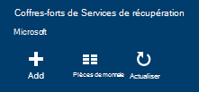

<properties
  pageTitle="Préparation de votre environnement pour sauvegarder des charges de travail à l’aide du serveur de sauvegarde Azure | Microsoft Azure"
  description="Préparer votre environnement à utiliser le serveur de sauvegarde Azure pour protéger ou sauvegarder des charges de travail."
  services="backup"
  documentationCenter=""
  authors="PVRK"
  manager="shivamg"
  editor=""
  keywords="serveur de sauvegarde Azure ; protéger les charges de travail ; sauvegarder des charges de travail"/>

<tags
  ms.service="backup"
  ms.workload="storage-backup-recovery"
  ms.tgt_pltfrm="na"
  ms.devlang="na"
  ms.topic="article"
  ms.date="09/27/2016"
  ms.author="jimpark;trinadhk;pullabhk;markgal"/>

# <a name="preparing-to-back-up-workloads-using-azure-backup-server"></a>Préparation de la sauvegarde des charges de travail à l’aide du serveur de sauvegarde Azure

> [AZURE.SELECTOR]
- [Serveur de sauvegarde Azure](backup-azure-microsoft-azure-backup.md)
- [SCDPM](backup-azure-dpm-introduction.md)
- [Serveur de sauvegarde Azure (classique)](backup-azure-microsoft-azure-backup-classic.md)
- [SCDPM (classique)](backup-azure-dpm-introduction-classic.md)

Cet article explique comment préparer votre environnement pour sauvegarder des charges de travail à l’aide du serveur de sauvegarde Azure. Avec le serveur de sauvegarde Azure, vous pouvez protéger des charges de travail tels que les ordinateurs virtuels Hyper-V, Microsoft SQL Server, SharePoint Server, Microsoft Exchange et les clients Windows à partir d’une console unique. Vous pouvez également protéger les informations sous la forme de des charges de travail serveur (IaaS), tels que des ordinateurs virtuels dans Azure.

> [AZURE.NOTE] Azure dispose de deux modèles de déploiement pour la création et l’utilisation des ressources : [le Gestionnaire de ressources et classique](../resource-manager-deployment-model.md). Cet article fournit les informations et les procédures de restauration d’ordinateurs virtuels déployés à l’aide du modèle de gestionnaire de ressources.

Serveur de sauvegarde Azure de la fonctionnalité de sauvegarde de la charge de travail hérite de Data Protection Manager (DPM). Cette article fournit des documentation DPM à expliquer certaines fonctionnalités partagées. Bien que Azure Backup Server partage la plupart des mêmes fonctionnalités que DPM. N’est pas le cas d’Azure serveur de sauvegarde sur bande, ni s’intègre-t-il avec System Center.

## <a name="1-choose-an-installation-platform"></a>1. Sélectionnez une plateforme d’installation

La première étape vers la route le serveur de sauvegarde Azure doit configurer un serveur Windows. Votre serveur peut être dans Azure ou sur site.

### <a name="using-a-server-in-azure"></a>À l’aide d’un serveur dans Azure

Lors du choix d’un serveur pour exécuter le serveur de sauvegarde d’Azure, il est recommandé de que vous démarrez avec une image de la galerie de Windows Server 2012 R2 Datacenter. L’article de [créer votre première machine virtuelle de Windows dans le portail Azure](..\virtual-machines\virtual-machines-windows-hero-tutorial.md), fournit un didacticiel pour la mise en route avec la machine virtuelle recommandée dans Azure, même si vous n’avez jamais utilisé Azure avant. La configuration minimale recommandée pour le serveur de machine virtuelle (VM) doit être : A2 Standard avec 2 de cœurs et de 3,5 Go de RAM.

Protection des charges de travail avec le serveur de sauvegarde Azure a de nombreuses nuances. L' [Installation de DPM sous la forme d’une machine virtuelle Azure](https://technet.microsoft.com/library/jj852163.aspx), article explique ces nuances. Lisez cet article complètement avant le déploiement de l’ordinateur.

### <a name="using-an-on-premises-server"></a>À l’aide d’un serveur local

Si vous ne souhaitez pas exécuter le serveur de base dans Azure, vous pouvez exécuter le serveur sur un ordinateur virtuel Hyper-V, un VM VMware ou un hôte physique. La configuration minimale recommandée pour le matériel de serveur est 2 de cœurs et de 4 Go de RAM. Les systèmes d’exploitation pris en charge sont répertoriés dans le tableau suivant.

| Système d'exploitation        | Plate-forme           | POINT DE STOCK  |
| :------------- |-------------| :-----|
|Windows Server 2012 R2 et dernières SPs| 64 bits| Base de la norme, le centre de données,|
|Windows Server 2012 et dernières SPs|    64 bits| Centre de données, Foundation, Standard|
|Windows Storage Server 2012 R2 et dernières SPs  |64 bits|    Standard, groupe de travail|
|Stockage de Windows Server 2012 et dernières SPs |64 bits |Standard, groupe de travail|


Vous pouvez Dédupliquez le stockage DPM à l’aide de déduplication du serveur Windows. Découvrez comment [DPM et déduplication](https://technet.microsoft.com/library/dn891438.aspx) collaborer lors du déploiement dans des ordinateurs virtuels Hyper-V.

> [AZURE.NOTE]  Vous ne pouvez pas installer Azure Backup Server sur une machine exécutant en tant que contrôleur de domaine.

Vous devez joindre le serveur de sauvegarde Azure à un domaine. Si vous envisagez de déplacer le serveur vers un autre domaine, il est recommandé que vous joignez le serveur au nouveau domaine avant d’installer le serveur de sauvegarde Azure. Déplacement d’un ordinateur de serveur de sauvegarde Azure existant vers un nouveau domaine après déploiement *non pris en charge*.

## <a name="2-recovery-services-vault"></a>2. chambre forte de Services de récupération de

Envoyer des données de sauvegarde vers Azure ou conservez-le localement, le logiciel doit être connecté à Azure. Pour être plus spécifique, l’ordinateur du serveur de sauvegarde Azure doit être enregistré avec un coffre-fort de services de récupération.

Pour créer un coffre-fort de services de récupération :

1. Connectez-vous au [portail Azure](https://portal.azure.com/).

2. Dans le menu Hub, cliquez sur **Parcourir** , puis dans la liste des ressources, tapez **Les Services de récupération**. Comme vous commencez à taper, la liste de filtre en fonction de votre entrée. Cliquez sur **Services de récupération de coffre-fort**.

     <br/>

    La liste des Services de récupération des coffres-forts s’affiche.

3. Dans le menu des **Services de récupération des coffres-forts** , cliquez sur **Ajouter**.

    

    La lame de coffre-fort de Services de restauration s’ouvre, vous invitant à fournir un **nom**, un **abonnement**, un **groupe de ressources**et un **emplacement**.

    

4. Pour **nom**, entrez un nom convivial pour identifier le coffre-fort. Le nom doit être unique pour l’abonnement Azure. Tapez un nom qui contient entre 2 et 50 caractères. Il doit commencer par une lettre et peut contenir uniquement des lettres, des chiffres et des traits d’union.

5. Cliquez sur l' **abonnement** pour visualiser la liste des abonnements disponibles. Si vous n’êtes pas sûr de l’abonnement à utiliser, utilisez la valeur par défaut (ou suggéré) abonnement. Il y aura plusieurs choix uniquement si votre organisation compte est associé à plusieurs abonnements Azure.

6. Cliquez sur le **groupe de ressources** pour afficher la liste des groupes de ressources disponibles, ou cliquez sur **Nouveau** pour créer un nouveau groupe de ressources. Pour plus d’informations sur les groupes de ressources, consultez [vue d’ensemble du Gestionnaire de ressources Azure](../azure-resource-manager/resource-group-overview.md)

7. Cliquez sur l' **emplacement** pour sélectionner la zone géographique pour la chambre forte.

8. Cliquez sur **créer**. Elle peut prendre du temps pour la chambre forte de Services de récupération doit être créé. Surveiller les notifications d’état dans l’angle supérieur droit du portail.
Une fois votre coffre-fort est créé, il s’ouvre dans le portail.

### <a name="set-storage-replication"></a>Définir la réplication du stockage

L’option de réplication de stockage vous permet de choisir entre le stockage redondant geo et stockage redondant localement. Par défaut, votre coffre-fort a stockage redondant geo. Conservez l’option définie vers le stockage redondant geo si c’est votre sauvegarde principale. Choisissez le stockage redondant localement si vous souhaitez une option économique qui n’est pas tout à fait aussi durable. En savoir plus sur [géo-redondants](../storage/storage-redundancy.md#geo-redundant-storage) et des options de stockage [redondants localement](../storage/storage-redundancy.md#locally-redundant-storage) dans la [vue d’ensemble de la réplication de stockage Azure](../storage/storage-redundancy.md).

Pour modifier le paramètre de réplication du stockage :

1. Sélectionnez votre coffre-fort pour ouvrir le tableau de bord en chambre forte et la lame de paramètres. Si la lame de **paramètres** ne s’ouvre pas, cliquez sur **tous les paramètres** dans le tableau de bord de coffre-fort.

2. Sur la lame de **paramètres** , cliquez sur **l’Infrastructure de sauvegarde** > de**Configuration de sauvegarde** pour ouvrir la lame de la **Configuration de la sauvegarde** . Sur la lame de la **Configuration de la sauvegarde** , choisissez l’option de réplication de stockage pour Password vault.

    

    Après avoir choisi l’option de stockage pour Password vault, vous êtes prêt à associer de la machine virtuelle à la chambre forte. Pour commencer l’association, vous devez découvrir et enregistrer les ordinateurs virtuels Azure.

## <a name="3-software-package"></a>3. package logiciel

### <a name="downloading-the-software-package"></a>Télécharger le package logiciel
1. Connectez-vous au [portail Azure](https://portal.azure.com/).

2. Si vous avez déjà un coffre-fort est ouvert aux Services de récupération, passez à l’étape 3. Si vous n’avez pas un Services de récupération de chambre forte ouvert, mais dans le portail Azure, dans le menu de concentrateur, cliquez sur **Parcourir**.

    - Dans la liste des ressources, tapez **Les Services de récupération**.
    - Comme vous commencez à taper, la liste de filtre en fonction de votre entrée. Lorsque vous consultez les **Services de récupération des coffres-forts**, cliquez dessus.

    

    La liste des Services de récupération des coffres-forts s’affiche.

    - Dans la liste des Services de récupération des coffres-forts, sélectionner un coffre-fort.

    Le tableau de bord de coffre-fort sélectionné s’ouvre.

    

3. Lame de paramètres s’ouvre par défaut. Si elle est fermée, cliquez sur **paramètres** pour ouvrir la lame de paramètres.

    

4. Cliquez sur **sauvegarde** dans **Mise en route** pour ouvrir l’Assistant Mise en route.

    

5. Dans la mise en route qui s’ouvre, écran d’objectifs de sauvegarde sera sélectionnée automatiquement.
    

    Dans la section **objectifs de sauvegarde** , sélectionnez *local* pour *lequel votre charge de travail s’exécute*.

    

6. Sélectionnez les charges de travail que vous souhaitez protéger à l’aide du serveur de sauvegarde Azure dans *les charges de travail que vous souhaitez protéger* , puis cliquez sur **OK**.

    > [AZURE.NOTE] Si vous envisagez de protéger uniquement les fichiers et les dossiers, puis nous recommandons d’utiliser l’agent de sauvegarde d’Azure. Si vous envisagez de protéger des charges de travail plus que simplement des fichiers et des dossiers ou à l’avenir si vous envisagez de développer les besoins de protection, sélectionnez toutes les charges de travail.

    Cette modification entraînera l’Assistant Mise en route pour préparer l’infrastructure pour la protection des charges de travail sur site vers Azure.

    

7. De la lame **d’infrastructure de préparation** qui s’ouvre, cliquez sur les liens de **téléchargement** pour installer un serveur de sauvegarde Azure et informations d’identification du coffre-fort de téléchargement. Vous utilisez les informations d’identification de la chambre forte lors de l’enregistrement de serveur de sauvegarde Azure dans le coffre-fort de services de récupération. Les liens vous dirigent vers le centre de téléchargement où le logiciel peut être téléchargé.

    

8. Sélectionnez tous les fichiers et cliquez sur **suivant**. Télécharger tous les fichiers provenant la page de téléchargement de Microsoft Azure Backup et placer tous les fichiers dans le même dossier.

    

    Étant donné que la taille du téléchargement de tous les fichiers est ensemble > 3G, sur un 10 Mbits/s lien de téléchargement que peut prendre jusqu'à 60 minutes de la fin du téléchargement.


### <a name="extracting-the-software-package"></a>Extraction de l’ensemble de logiciels

Une fois que vous avez téléchargé tous les fichiers, cliquez sur **MicrosoftAzureBackupInstaller.exe**. Ceci démarrera l' **Assistant de configuration de sauvegarde Microsoft Azure** pour extraire les fichiers d’installation vers un emplacement spécifié par vous. Poursuivez les étapes de l’Assistant, cliquez sur le bouton **Extraire** pour commencer le processus d’extraction.

> [AZURE.WARNING] Au moins 4 Go d’espace libre est nécessaire pour extraire les fichiers d’installation.


Une fois l’extraction traiter terminée, cochez la case pour lancer le fraîchement extraits *setup.exe* pour commencer l’installation du serveur de sauvegarde de Microsoft Azure et cliquez sur le bouton **Terminer** .

### <a name="installing-the-software-package"></a>L’installation du package logiciel

1. Cliquez sur **Microsoft Azure sauvegarde** pour lancer l’Assistant d’installation.

    

2. Sur l’écran de bienvenue, cliquez sur le bouton **suivant** . Vous accédez à la section *Vérifications préalables* . Sur cet écran, cliquez sur le bouton **Vérifier** pour déterminer si les composants matériels et logiciels requis pour le serveur de sauvegarde Azure ont été respectées. Si toutes les conditions préalables sont ont été satisfaits avec succès, vous verrez un message indiquant que l’ordinateur répond aux exigences. Cliquez sur le bouton **suivant** .

    

3. Serveur de sauvegarde de Microsoft Azure nécessite SQL Server Standard, et le package d’installation de serveur de sauvegarde Azure est livré avec les binaires SQL Server appropriés nécessaires. Lors du démarrage d’une nouvelle installation du serveur de sauvegarde Azure, vous devez choisir l’option **Installation nouvelle Instance de SQL Server avec ce programme d’installation** et cliquez sur le bouton **vérifier et installer** . Une fois les composants requis sont installés avec succès, cliquez sur **suivant**.

    

    Si une défaillance se produit avec une recommandation de redémarrer l’ordinateur, faites-le et cliquez sur **Vérifier à nouveau**.

    > [AZURE.NOTE] Serveur de sauvegarde Azure ne fonctionnera pas avec une instance de SQL Server à distance. L’instance utilisée par le serveur de sauvegarde Azure doit être local.

4. Fournir un emplacement pour l’installation des fichiers de serveur de sauvegarde de Microsoft Azure et cliquez sur **suivant**.

    

    L’emplacement de montage est une condition requise pour la sauvegarde sur Azure. Assurez-vous que l’emplacement de montage est d’au moins 5 % des données prévues pour être sauvegardé dans le cloud. Pour la protection des disques, des disques distincts doivent être configurés pour une fois l’installation terminée. Pour plus d’informations sur les pools de stockage, voir [configurer les pools de stockage et le stockage sur disque](https://technet.microsoft.com/library/hh758075.aspx).

5. Fournir un mot de passe pour les comptes d’utilisateur locaux restreints et cliquez sur **suivant**.

    

6. Indiquez si vous souhaitez utiliser *Microsoft Update* pour vérifier les mises à jour et cliquez sur **suivant**.

    >[AZURE.NOTE] Nous vous conseillons la mise à jour de Windows rediriger vers Microsoft Update, qui propose une sécurité et des mises à jour importantes pour Windows et d’autres produits comme le serveur de sauvegarde de Microsoft Azure.

    

7. Passez en revue le *Résumé des paramètres* , puis cliquez sur **installer**.

    

8. L’installation s’effectue en plusieurs phases. Dans la première phase, l’Agent de Services de récupération de Microsoft Azure est installé sur le serveur. L’Assistant vérifie également pour la connectivité Internet. Si la connexion Internet est disponible vous pouvez poursuivre l’installation, si ce n’est pas, vous devez fournir les détails proxy pour se connecter à Internet.

    L’étape suivante consiste à configurer l’Agent de Services de récupération de Microsoft Azure. Dans le cadre de la configuration, vous devez fournir vos informations d’identification de coffre-fort pour inscrire l’ordinateur dans le coffre-fort de services de récupération. Vous allez également fournir un mot de passe pour chiffrer/déchiffrer des données envoyées entre Azure et les locaux de l’entreprise. Vous pouvez automatiquement générer une phrase secrète ou fournir votre propre mot de passe 16 caractères minimum. Continuez avec l’Assistant jusqu'à ce que l’agent a été configuré.

    

9. Une fois l’enregistrement du serveur Microsoft Azure sauvegarde terminée, l’Assistant de configuration globale procède à l’installation et la configuration de SQL Server et les composants du serveur de sauvegarde Azure. Une fois l’installation de composants SQL Server terminée, les composants du serveur de sauvegarde Azure sont installés.

    


À l’issue de l’étape d’installation, les icônes du bureau du produit aura été créés ainsi. Double-cliquez sur l’icône pour lancer le produit.

### <a name="add-backup-storage"></a>Ajouter du stockage de sauvegarde

La première copie de sauvegarde est conservée sur le stockage relié à l’ordinateur du serveur de sauvegarde Azure. Pour plus d’informations sur l’ajout de disques, consultez [configurer les pools de stockage et le stockage sur disque](https://technet.microsoft.com/library/hh758075.aspx).

> [AZURE.NOTE] Vous devez ajouter le stockage de sauvegarde même si vous envisagez d’envoyer des données vers Azure. Dans l’architecture actuelle de serveur de sauvegarde Azure, le coffre-fort Azure sauvegarde conserve la *deuxième* copie des données, alors que le stockage local conserve la copie de sauvegarde de premier (et obligatoire).

## <a name="4-network-connectivity"></a>4. connectivité réseau

Serveur de sauvegarde Azure nécessite une connexion pour le service de sauvegarde d’Azure pour le produit fonctionne correctement. Pour valider si l’ordinateur dispose de la connectivité d’Azure, utilisez le ```Get-DPMCloudConnection``` applet de commande dans la console PowerShell de serveur de sauvegarde Azure. Si la sortie de l’applet de commande est le vrai connectivité existe, sinon, il n’y a pas de connectivité.

Dans le même temps, l’abonnement Azure doit être dans un état sain. Pour déterminer l’état de votre abonnement et de le gérer, connectez-vous au [portail de l’abonnement]( https://account.windowsazure.com/Subscriptions).

Une fois que vous connaissez l’état de la connectivité d’Azure et de l’abonnement Azure, vous pouvez utiliser le tableau ci-dessous pour connaître l’impact sur la fonctionnalité de sauvegarde et de restauration proposée.

| État de la connectivité | Abonnement Azure | Sauvegarde vers Azure| Sauvegarde sur disque | Restaurer à partir d’Azure | Restaurer à partir du disque |
| -------- | ------- | --------------------- | ------------------- | --------------------------- | ----------------------- |
| Connecté | Active | Autorisé | Autorisé | Autorisé | Autorisé |
| Connecté | Expiré | Arrêté | Arrêté | Autorisé | Autorisé |
| Connecté | Arrêtés | Arrêté | Arrêté | Points de récupération arrêté et Azure supprimés | Arrêté |
| Perte de connectivité > 15 jours | Active | Arrêté | Arrêté | Autorisé | Autorisé |
| Perte de connectivité > 15 jours | Expiré | Arrêté | Arrêté | Autorisé | Autorisé |
| Perte de connectivité > 15 jours | Arrêtés | Arrêté | Arrêté |  Points de récupération arrêté et Azure supprimés | Arrêté |

### <a name="recovering-from-loss-of-connectivity"></a>Récupération à partir de la perte de la connectivité
Si vous disposez d’un pare-feu ou un proxy qui empêche l’accès sur Azure, vous devez d’autorisation les adresses de domaine suivantes dans le profil de pare-feu/proxy :

- www.msftncsi.com
- \*. Microsoft.com
- \*. WindowsAzure.com
- \*. microsoftonline.com
- \*. windows.net

Une fois la connectivité vers Azure a été restaurée sur la machine serveur de sauvegarde Azure, les opérations qui peuvent être effectuées sont déterminées par l’état d’abonnement Azure. Le tableau ci-dessus a plus d’informations sur les opérations autorisées dès que l’ordinateur est « connecté ».

### <a name="handling-subscription-states"></a>Gestion des États de l’abonnement

Il est possible de prendre un abonnement Azure à partir d’un état *expiré* ou *Deprovisioned* à l’état *actif* . Toutefois, ceci a certaines conséquences sur le comportement du produit alors que l’état n’est pas *actif*:

- Un abonnement *Deprovisioned* perd la fonctionnalité pour la période pour laquelle il est arrêté. Sur la sélection *Active*, les fonctionnalités du produit de sauvegarde/restauration sont réactivée. Les données de sauvegarde sur le disque local peuvent également être récupérées si elle a été conservé avec une période de rétention suffisante. Toutefois, les données de sauvegarde dans Azure sont irrémédiablement perdues une fois l’abonnement passe à l’état de *Deprovisioned* .
- Un abonnement *expiré* perd uniquement les fonctionnalités de jusqu'à ce qu’il a été rendu *actif* à nouveau. Toutes les sauvegardes planifiées pour la période que l’abonnement a *expiré* ne seront exécutera pas.


## <a name="troubleshooting"></a>Résolution des problèmes

Si le serveur de sauvegarde de Microsoft Azure échoue avec des erreurs au cours de la phase d’installation (ou de sauvegarde ou de restauration), reportez-vous à ce [document de codes d’erreur](https://support.microsoft.com/kb/3041338) pour plus d’informations.
Vous pouvez également faire référence à [Qu'azure sauvegarde liés à des questions fréquentes](backup-azure-backup-faq.md)


## <a name="next-steps"></a>Étapes suivantes

Vous pouvez obtenir des informations détaillées sur la [Préparation de votre environnement pour DPM](https://technet.microsoft.com/library/hh758176.aspx) sur le site TechNet de Microsoft. Il contient également des informations sur les configurations prises en charge sur lequel Azure Backup Server peuvent être déployé et utilisé.

Vous pouvez utiliser ces articles pour obtenir une bonne compréhension de la protection de la charge de travail à l’aide du serveur de sauvegarde de Microsoft Azure.

- [Sauvegarde de SQL Server](backup-azure-backup-sql.md)
- [Sauvegarde du serveur SharePoint](backup-azure-backup-sharepoint.md)
- [Sauvegarde de serveur de remplacement](backup-azure-alternate-dpm-server.md)
