<properties
    pageTitle="Apprenez à utiliser le connecteur Twitter dans les applications de logique | Microsoft Azure"
    description="Vue d’ensemble du connecteur Twitter avec les paramètres de l’API REST"
    services=""
    documentationCenter="" 
    authors="msftman"
    manager="erikre"
    editor=""
    tags="connectors"/>

<tags
   ms.service="multiple"
   ms.devlang="na"
   ms.topic="article"
   ms.tgt_pltfrm="na"
   ms.workload="na" 
   ms.date="07/18/2016"
   ms.author="deonhe"/>

# Mise en route avec le connecteur Twitter

Avec le connecteur Twitter, vous pouvez :

- Tweet de post et get tweet
- Suiveurs, des amis et des chronologies d’accès
- Effectuer toutes les autres actions et déclencheurs décrites ci-dessous  

Pour utiliser [un connecteur](./apis-list.md), vous devez d’abord créer une application de logique. Vous pouvez commencer par [créer une application de logique maintenant](../app-service-logic/app-service-logic-create-a-logic-app.md).  

## Se connecter à Twitter

Avant que votre application logique peut accéder à n’importe quel service, vous devez d’abord créer une *connexion* au service. Une [connexion](./connectors-overview.md) fournit une connectivité entre une application logique et un autre service.  

### Créer une connexion à Twitter

>[AZURE.INCLUDE [Steps to create a connection to Twitter](../../includes/connectors-create-api-twitter.md)]

## Utilisez un déclencheur Twitter

Un déclencheur est un événement qui peut être utilisé pour démarrer le flux de travail défini dans une logique d’application. [En savoir plus sur les déclencheurs](../app-service-logic/app-service-logic-what-are-logic-apps.md#logic-app-concepts).

Dans cet exemple, je vais vous montrer à utiliser **lors de la validation d’un tweet nouveau** déclencheur pour rechercher #Seattle et, si #Seattle est trouvé, mettre à jour un fichier dans le dossier d’échange avec le texte à partir de celui-ci. Dans un exemple d’entreprise, vous pouvez rechercher le nom de votre société et mettre à jour une base de données SQL avec le texte à partir de celui-ci.

1. Entrez *twitter* dans la zone de recherche dans le Concepteur d’applications logique, puis sélectionnez le déclencheur **Twitter - lors de la validation d’un tweet nouveau**   
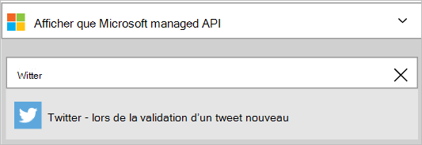  
- Entrez *#Seattle* dans le contrôle de **Texte de recherche**  
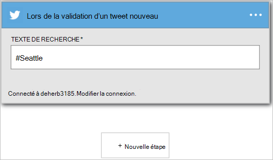 

À ce stade, votre application logique a été configurée avec un déclencheur qui commence une série d’autres déclencheurs et actions dans le flux de travail. 

>[AZURE.NOTE]Pour une logique d’application fonctionne, elle doit contenir au moins un déclencheur et une action. Suivez les étapes décrites dans la section suivante pour ajouter une action.  

## Ajouter une condition
Étant donné que nous sommes uniquement intéressé dans tweet provenant d’utilisateurs avec plus de 50 utilisateurs, une condition qui confirme le nombre imposait doit d’abord être ajoutée à l’application de la logique.  

1. Sélectionnez **+ nouvelle étape** pour ajouter l’action à prendre lorsque le #Seattle se trouve dans un nouveau tweet  
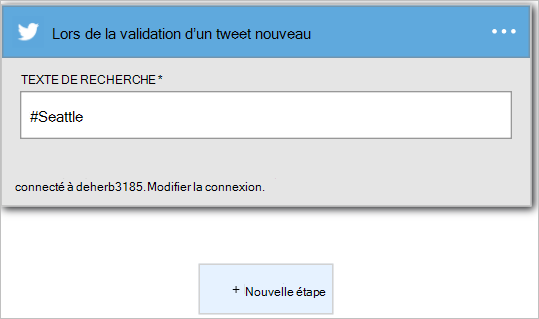  
- Cliquez sur le lien **Ajouter une condition** .  
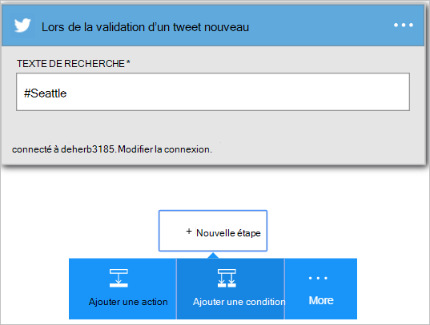   
Cela ouvre le contrôle de **l’état** dans lequel vous pouvez vérifier des conditions telles *est égal à*, *est inférieure à*, *est supérieur à*, *contient*, etc..  
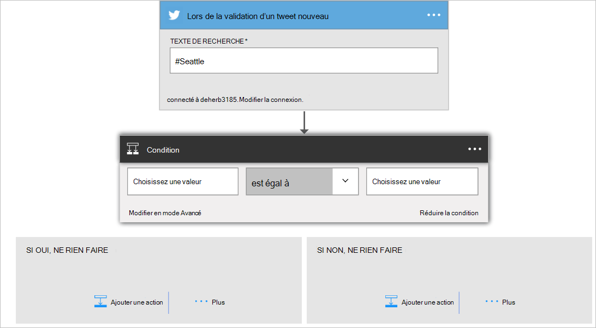   
- Sélectionnez le contrôle de **Choisir une valeur** .  
Dans ce contrôle, vous pouvez sélectionner une ou plusieurs des propriétés de toutes les actions précédentes ou déclencheurs comme valeur dont la condition sera évaluée à true ou false.
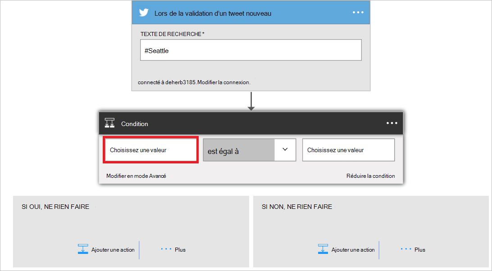   
- Sélectionnez le **...** pour développer la liste des propriétés afin d’afficher toutes les propriétés qui sont disponibles.        
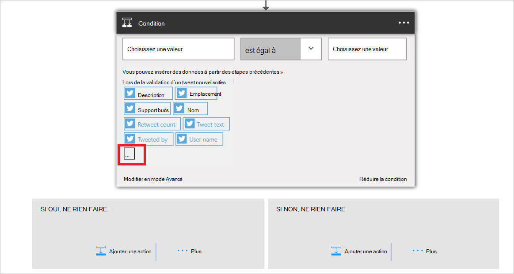   
- Sélectionnez la propriété **count de marché** .    
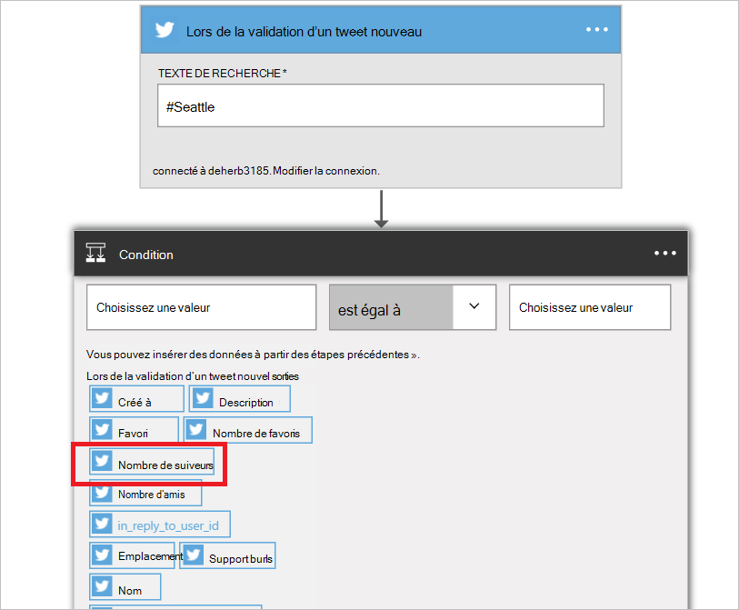   
- Notez que la propriété count du marché est présent dans le contrôle de la valeur.    
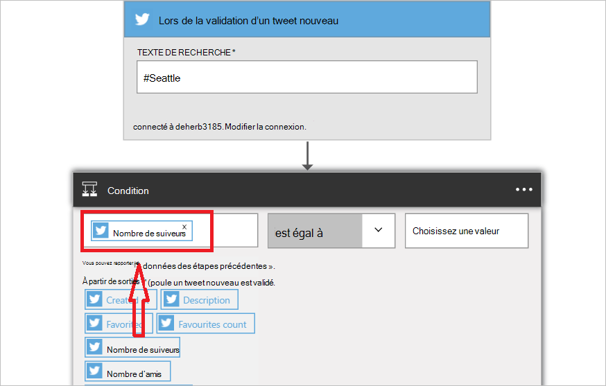   
- Sélectionnez **est supérieur à** dans la liste opérateurs.    
   
- Entrez 50 comme opérande de l’opérateur *est supérieur à* .  
La condition est ajoutée. Enregistrez votre travail à l’aide de **Enregistrer** le lien dans le menu ci-dessus.    
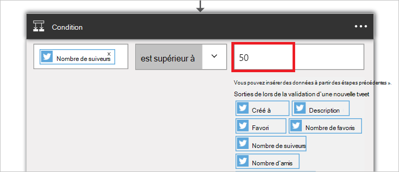   

## Utiliser une action Twitter

Une action est une opération effectuée par le flux de travail défini dans une logique d’application. [En savoir plus sur les actions](../app-service-logic/app-service-logic-what-are-logic-apps.md#logic-app-concepts).  

Maintenant que vous avez ajouté un déclencheur, procédez comme suit pour ajouter une action qui publiera un nouveau tweet avec le contenu de la tweet trouvé par le déclencheur. Pour les besoins de cette procédure est validées uniquement tweet provenant d’utilisateurs avec barreaux de plus de 50.  

À l’étape suivante, vous allez ajouter une action Twitter qui publiera un tweet à l’aide des propriétés de chaque tweet qui a été validé par un utilisateur qui dispose de plus de 50 barreaux.  

1. Sélectionnez **Ajouter une action**. Cela ouvre le contrôle de recherche dans lequel vous pouvez rechercher des autres actions et des déclencheurs.  
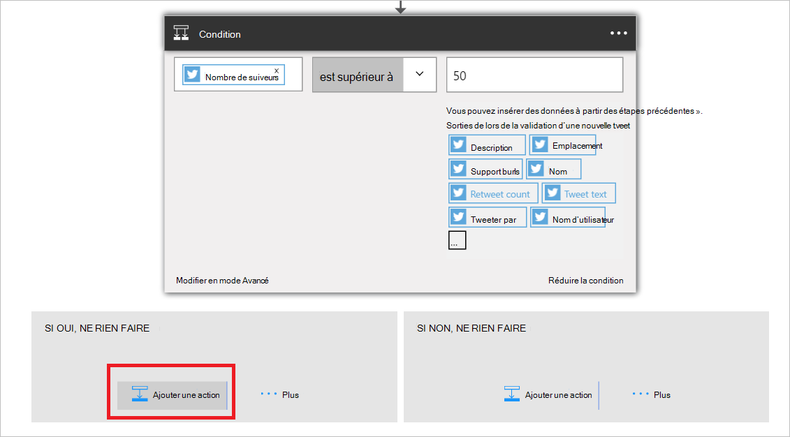   
- Entrez *twitter* dans la zone Rechercher, puis sélectionnez l’action de **Twitter - Post un tweet** . Le contrôle de **valider un tweet** dans laquelle vous entrerez tous les détails de celui-ci en cours de validation s’ouvre.      
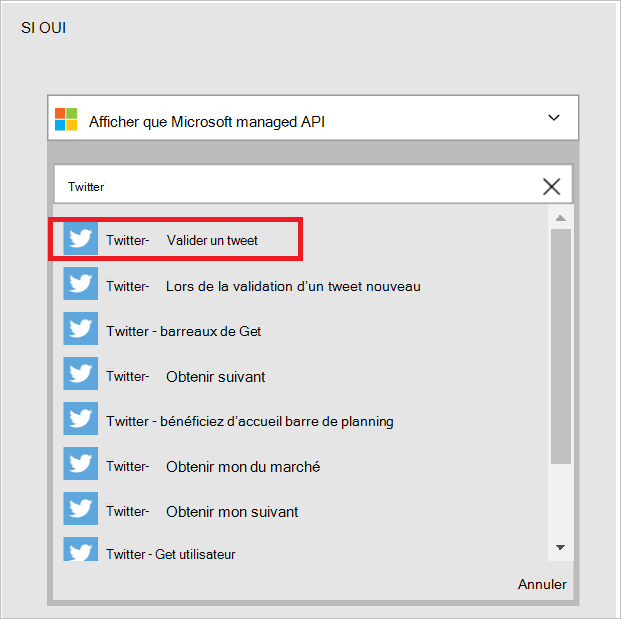   
- Sélectionnez le contrôle **texte Tweet** . Toutes les sorties à partir des actions précédentes et les déclencheurs dans la logique d’application sont désormais visibles. Vous pouvez sélectionner une de ces et les utiliser dans le cadre du texte de la nouvelle tweet tweet.     
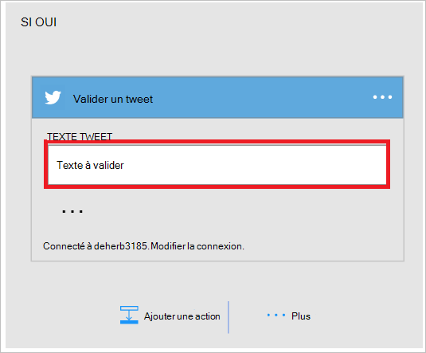   
- Sélectionnez le **nom d’utilisateur**   
- Entrez *indique :* dans le contrôle de texte tweet. Pour ce faire, juste après le nom d’utilisateur.  
- Sélectionnez *texte Tweet*.       
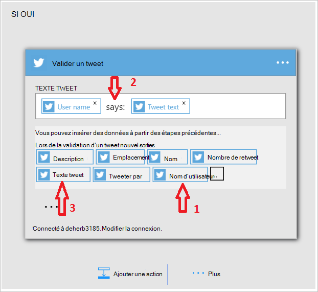   
- Enregistrez votre travail et envoyer un tweet avec le hashtag #Seattle pour activer votre flux de travail.  

## Détails techniques

Voici les détails sur les déclencheurs, les actions et les réponses qui prend en charge de cette connexion :

## Déclencheurs de Twitter

Le connecteur Twitter a l’ou les déclencheurs suivant :  

|Déclencheur | Description|
|--- | ---|
|[Lors de la validation d’un tweet nouveau](connectors-create-api-twitter.md#when-a-new-tweet-is-posted)|Cette opération déclenche un flux lors de la validation d’un tweet nouvel qui correspond à une requête de recherche donnée.|

## Actions de Twitter

Le connecteur Twitter comprend les actions suivantes :

|Action|Description|
|--- | ---|
|[Obtenir la chronologie de l’utilisateur](connectors-create-api-twitter.md#get-user-timeline)|Cette opération Obtient une liste de la plus récente tweet validée par un utilisateur donné.|
|[Obtenir la maison de chronologie](connectors-create-api-twitter.md#get-home-timeline)|Cette opération Obtient les plus récentes tweet et ré-tweets publiés par moi et mon du marché.|
|[Recherche tweet](connectors-create-api-twitter.md#search-tweets)|Cette opération Obtient une liste de tweet approprié correspondant à la requête de recherche.|
|[Obtenir du marché](connectors-create-api-twitter.md#get-followers)|Cette opération Obtient la liste des utilisateurs qui suivent un utilisateur donné.|
|[Obtenir mon du marché](connectors-create-api-twitter.md#get-my-followers)|Cette opération Obtient la liste des utilisateurs qui suivent me.|
|[Obtenir suivant](connectors-create-api-twitter.md#get-following)|L’opération Obtient la liste des personnes à l’utilisateur donné suit.|
|[Obtenir mon suivant](connectors-create-api-twitter.md#get-my-following)|Cette opération Obtient la liste des utilisateurs que je vous contacte.|
|[Obtenir l’utilisateur](connectors-create-api-twitter.md#get-user)|Cette opération Obtient les informations de profil pour un utilisateur donné, par exemple le nom d’utilisateur, description, nombre de marché et bien plus encore.|
|[Valider un tweet](connectors-create-api-twitter.md#post-a-tweet)|Cette opération publie un nouveau tweet.|
## Détails de l’action

Voici les détails des actions et des déclencheurs pour ce connecteur, ainsi que leurs réponses :

### Obtenir la chronologie de l’utilisateur
Cette opération Obtient une liste de la plus récente tweet validée par un utilisateur donné. 

|Nom de la propriété| Nom complet|Description|
| ---|---|---|
|nom d’utilisateur *|Nom d’utilisateur|Poignée Twitter de l’utilisateur|
|maxResults|Nombre maximal de résultats|Nombre maximal de tweet à renvoyer|

Un * indique qu’une propriété est obligatoire

#### Détails de sortie

TweetModel : Représentation sous forme de Tweet objet

| Nom de la propriété | Type de données | Description |
|---|---|---|
|TweetText|chaîne|Contenu de texte de celui-ci|
|TweetId|chaîne|ID de celui-ci|
|Créédans|chaîne|Heure à laquelle celui-ci a été validée.|
|RetweetCount|nombre entier|Nombre total de ré-tweets de celui-ci|
|TweetedBy|chaîne|Nom de l’utilisateur qui a validé la tweet|
|MediaUrls|tableau|URL du support validé avec celui-ci|
|TweetLanguageCode|chaîne|Code de la langue de celui-ci|
|TweetInReplyToUserId|chaîne|Id utilisateur de l’auteur de celui-ci que celui-ci en cours est une réponse à|
|Favorited|valeur booléenne|Indique si celui-ci est marqué comme favorited ou non|
|UserMentions|tableau|Liste des utilisateurs mentionnés dans celui-ci|
|OriginalTweet|non défini|Tweet d’origine à partir duquel le tweet actuel est nouveau tweetée|
|UserDetails|non défini|Détails de l’utilisateur qui Tweeter|

### Obtenir la maison de chronologie
Cette opération Obtient les plus récentes tweet et ré-tweets publiés par moi et mon du marché. 

|Nom de la propriété| Nom complet|Description|
| ---|---|---|
|maxResults|Nombre maximal de résultats|Nombre maximal de tweet à renvoyer|

Un * indique qu’une propriété est obligatoire

#### Détails de sortie

TweetModel : Représentation sous forme de Tweet objet

| Nom de la propriété | Type de données | Description |
|---|---|---|
|TweetText|chaîne|Contenu de texte de celui-ci|
|TweetId|chaîne|ID de celui-ci|
|Créédans|chaîne|Heure à laquelle celui-ci a été validée.|
|RetweetCount|nombre entier|Nombre total de ré-tweets de celui-ci|
|TweetedBy|chaîne|Nom de l’utilisateur qui a validé la tweet|
|MediaUrls|tableau|URL du support validé avec celui-ci|
|TweetLanguageCode|chaîne|Code de la langue de celui-ci|
|TweetInReplyToUserId|chaîne|Id utilisateur de l’auteur de celui-ci que celui-ci en cours est une réponse à|
|Favorited|valeur booléenne|Indique si celui-ci est marqué comme favorited ou non|
|UserMentions|tableau|Liste des utilisateurs mentionnés dans celui-ci|
|OriginalTweet|non défini|Tweet d’origine à partir duquel le tweet actuel est nouveau tweetée|
|UserDetails|non défini|Détails de l’utilisateur qui Tweeter|

### Recherche tweet
Cette opération Obtient une liste de tweet approprié correspondant à la requête de recherche. 

|Nom de la propriété| Nom complet|Description|
| ---|---|---|
|searchQuery *|Texte de recherche|Rechercher des termes comme « happy heure », #haiku, amour haine d’OR|
|maxResults|Nombre maximal de résultats|Nombre maximal de tweet à renvoyer|

Un * indique qu’une propriété est obligatoire

#### Détails de sortie

TweetModel : Représentation sous forme de Tweet objet

| Nom de la propriété | Type de données | Description |
|---|---|---|
|TweetText|chaîne|Contenu de texte de celui-ci|
|TweetId|chaîne|ID de celui-ci|
|Créédans|chaîne|Heure à laquelle celui-ci a été validée.|
|RetweetCount|nombre entier|Nombre total de ré-tweets de celui-ci|
|TweetedBy|chaîne|Nom de l’utilisateur qui a validé la tweet|
|MediaUrls|tableau|URL du support validé avec celui-ci|
|TweetLanguageCode|chaîne|Code de la langue de celui-ci|
|TweetInReplyToUserId|chaîne|Id utilisateur de l’auteur de celui-ci que celui-ci en cours est une réponse à|
|Favorited|valeur booléenne|Indique si celui-ci est marqué comme favorited ou non|
|UserMentions|tableau|Liste des utilisateurs mentionnés dans celui-ci|
|OriginalTweet|non défini|Tweet d’origine à partir duquel le tweet actuel est nouveau tweetée|
|UserDetails|non défini|Détails de l’utilisateur qui Tweeter|

### Obtenir du marché
Cette opération Obtient la liste des utilisateurs qui suivent un utilisateur donné. 

|Nom de la propriété| Nom complet|Description|
| ---|---|---|
|nom d’utilisateur *|Nom d’utilisateur|Poignée Twitter de l’utilisateur|
|maxResults|Nombre maximal de résultats|Nombre maximal d’utilisateurs à renvoyer|

Un * indique qu’une propriété est obligatoire

#### Détails de sortie

UserDetailsModel : Détails de l’utilisateur Twitter

| Nom de la propriété | Type de données | Description |
|---|---|---|
|FullName|chaîne|Nom de l’utilisateur|
|Emplacement|chaîne|Emplacement de l’utilisateur|
|ID|nombre entier|Id Twitter de l’utilisateur|
|Nom d’utilisateur|chaîne|Nom de l’écran de l’utilisateur|
|FollowersCount|nombre entier|Nombre de barreaux de|
|Description|chaîne|Description de l’utilisateur|
|StatusesCount|nombre entier|Nombre d’état utilisateur|
|FriendsCount|nombre entier|Nombre d’amis|
|FavouritesCount|nombre entier|Nombre de tweet que l’utilisateur a favorited|
|ProfileImageUrl|chaîne|URL de l’image de profil|

### Obtenir mon du marché
Cette opération Obtient la liste des utilisateurs qui suivent me. 

|Nom de la propriété| Nom complet|Description|
| ---|---|---|
|maxResults|Nombre maximal de résultats|Nombre maximal d’utilisateurs pour obtenir|

Un * indique qu’une propriété est obligatoire

#### Détails de sortie

UserDetailsModel : Détails de l’utilisateur Twitter

| Nom de la propriété | Type de données | Description |
|---|---|---|
|FullName|chaîne|Nom de l’utilisateur|
|Emplacement|chaîne|Emplacement de l’utilisateur|
|ID|nombre entier|Id Twitter de l’utilisateur|
|Nom d’utilisateur|chaîne|Nom de l’écran de l’utilisateur|
|FollowersCount|nombre entier|Nombre de barreaux de|
|Description|chaîne|Description de l’utilisateur|
|StatusesCount|nombre entier|Nombre d’état utilisateur|
|FriendsCount|nombre entier|Nombre d’amis|
|FavouritesCount|nombre entier|Nombre de tweet que l’utilisateur a favorited|
|ProfileImageUrl|chaîne|URL de l’image de profil|

### Obtenir suivant
L’opération Obtient la liste des personnes à l’utilisateur donné suit. 

|Nom de la propriété| Nom complet|Description|
| ---|---|---|
|nom d’utilisateur *|Nom d’utilisateur|Poignée Twitter de l’utilisateur|
|maxResults|Nombre maximal de résultats|Nombre maximal d’utilisateurs à renvoyer|

Un * indique qu’une propriété est obligatoire

#### Détails de sortie

UserDetailsModel : Détails de l’utilisateur Twitter

| Nom de la propriété | Type de données | Description |
|---|---|---|
|FullName|chaîne|Nom de l’utilisateur|
|Emplacement|chaîne|Emplacement de l’utilisateur|
|ID|nombre entier|Id Twitter de l’utilisateur|
|Nom d’utilisateur|chaîne|Nom de l’écran de l’utilisateur|
|FollowersCount|nombre entier|Nombre de barreaux de|
|Description|chaîne|Description de l’utilisateur|
|StatusesCount|nombre entier|Nombre d’état utilisateur|
|FriendsCount|nombre entier|Nombre d’amis|
|FavouritesCount|nombre entier|Nombre de tweet que l’utilisateur a favorited|
|ProfileImageUrl|chaîne|URL de l’image de profil|

### Obtenir mon suivant
Cette opération Obtient la liste des utilisateurs que je vous contacte. 

|Nom de la propriété| Nom complet|Description|
| ---|---|---|
|maxResults|Nombre maximal de résultats|Nombre maximal d’utilisateurs à renvoyer|

Un * indique qu’une propriété est obligatoire

#### Détails de sortie

UserDetailsModel : Détails de l’utilisateur Twitter

| Nom de la propriété | Type de données | Description |
|---|---|---|
|FullName|chaîne|Nom de l’utilisateur|
|Emplacement|chaîne|Emplacement de l’utilisateur|
|ID|nombre entier|Id Twitter de l’utilisateur|
|Nom d’utilisateur|chaîne|Nom de l’écran de l’utilisateur|
|FollowersCount|nombre entier|Nombre de barreaux de|
|Description|chaîne|Description de l’utilisateur|
|StatusesCount|nombre entier|Nombre d’état utilisateur|
|FriendsCount|nombre entier|Nombre d’amis|
|FavouritesCount|nombre entier|Nombre de tweet que l’utilisateur a favorited|
|ProfileImageUrl|chaîne|URL de l’image de profil|

### Obtenir l’utilisateur
Cette opération Obtient les informations de profil pour un utilisateur donné, par exemple le nom d’utilisateur, description, nombre de marché et bien plus encore. 

|Nom de la propriété| Nom complet|Description|
| ---|---|---|
|nom d’utilisateur *|Nom d’utilisateur|Poignée Twitter de l’utilisateur|

Un * indique qu’une propriété est obligatoire

#### Détails de sortie

UserDetailsModel : Détails de l’utilisateur Twitter

| Nom de la propriété | Type de données | Description |
|---|---|---|
|FullName|chaîne|Nom de l’utilisateur|
|Emplacement|chaîne|Emplacement de l’utilisateur|
|ID|nombre entier|Id Twitter de l’utilisateur|
|Nom d’utilisateur|chaîne|Nom de l’écran de l’utilisateur|
|FollowersCount|nombre entier|Nombre de barreaux de|
|Description|chaîne|Description de l’utilisateur|
|StatusesCount|nombre entier|Nombre d’état utilisateur|
|FriendsCount|nombre entier|Nombre d’amis|
|FavouritesCount|nombre entier|Nombre de tweet que l’utilisateur a favorited|
|ProfileImageUrl|chaîne|URL de l’image de profil|

### Valider un tweet
Cette opération publie un nouveau tweet. 

|Nom de la propriété| Nom complet|Description|
| ---|---|---|
|tweetText|Texte tweet|Texte à valider|
|corps|Médias|Média à valider|

Un * indique qu’une propriété est obligatoire

#### Détails de sortie

TweetResponseModel : Modèle représentant validé un Tweet

| Nom de la propriété | Type de données | Description |
|---|---|---|
|TweetId|chaîne|ID de la tweet récupéré|

### Lors de la validation d’un tweet nouveau
Cette opération déclenche un flux lors de la validation d’un tweet nouvel qui correspond à une requête de recherche donnée. 

|Nom de la propriété| Nom complet|Description|
| ---|---|---|
|searchQuery *|Texte de recherche|Rechercher des termes comme « happy heure », #haiku, amour haine d’OR|

Un * indique qu’une propriété est obligatoire

#### Détails de sortie

TriggerBatchResponse [TweetModel]

| Nom de la propriété | Type de données |
|---|---|
|valeur|tableau|

## Réponses HTTP

Les actions et les déclencheurs ci-dessus peuvent retourner un ou plusieurs des codes d’état HTTP suivants : 

|Nom|Description|
|---|---|
|200|Bien|
|202|Accepté|
|400|Demande incorrecte|
|401|Non autorisé|
|403|Interdit|
|404|Non trouvé|
|500|Erreur de serveur interne. Une erreur inconnue s’est produite.|
|par défaut|Échoué de l’opération.|

## Étapes suivantes
[Créer une application de logique](../app-service-logic/app-service-logic-create-a-logic-app.md)