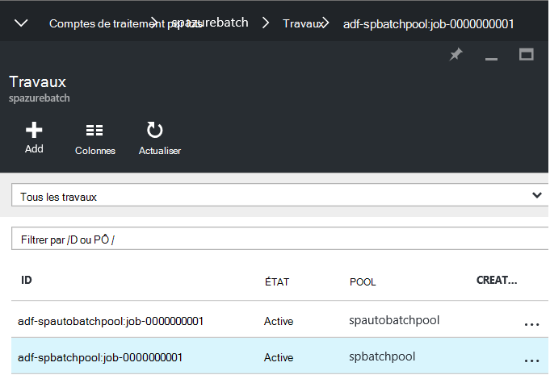

<properties
    pageTitle="Traiter les groupes de données à grande échelle à l’aide de la fabrique de données et de la feuille | Microsoft Azure"
    description="Décrit comment traiter les énormes volumes de données dans un pipeline Azure Data Factory à l’aide d’une capacité de traitement parallèle de lot d’Azure."
    services="data-factory"
    documentationCenter=""
    authors="spelluru"
    manager="jhubbard"
    editor="monicar"/>

<tags
    ms.service="data-factory"
    ms.workload="data-services"
    ms.tgt_pltfrm="na"
    ms.devlang="na"
    ms.topic="article"
    ms.date="10/17/2016"
    ms.author="spelluru"/>

# Processus à grande échelle des groupes de données à l’aide de la fabrique de données et de traitement par lots
Cet article décrit une architecture d’une solution de l’échantillon qui se déplace et traite des groupes de données à grande échelle de manière automatique et planifiée. Il fournit également une procédure pas à pas de bout en bout pour implémenter la solution à l’aide de la fabrique de données Azure et d’Azure lot. 

Cet article est plus long que notre article standard, car elle contient une procédure pas à pas d’une solution de l’exemple complet. Si vous êtes nouveau sur lot et l’usine de données, vous pouvez en savoir plus sur ces services et comment ils fonctionnent ensemble. Si vous avez des informations sur les services et sont conception/élaboration d’une solution, vous pouvez concentrer uniquement sur la [section d’architecture](#architecture-of-sample-solution) , de l’article et si vous développez un prototype ou une solution, vous pouvez également essayer les instructions étape par étape de la [procédure pas à pas](#implementation-of-sample-solution). Nous vous invitons à vos commentaires sur ce contenu et la façon de l’utiliser.

Tout d’abord, nous allons voir comment les services Data Factory et de traitement par lots peuvent aider dans le traitement de grands volumes de données dans le nuage.     

## Pourquoi lot Azure ?
Lot Azure permet de vous afin de s’exécuter à grande échelle parallèle et haute performance computing (HPC) des applications dans le nuage. Il s’agit d’un service de plate-forme qui planifie le travail de calcul intensif pour s’exécuter sur une collection managée de machines virtuelles, et pouvez échelle calculer automatiquement les ressources pour répondre aux besoins de vos projets.

Avec le service de traitement par lots, vous définissez des ressources de calcul Azure pour exécuter vos applications en parallèle et à grande échelle. Vous pouvez exécuter à la demande ou planifiées travaux et que vous n’avez pas besoin manuellement créer, configurer et gérer un cluster HPC, les machines virtuelles, les réseaux virtuels ou un travail complexe et infrastructure de planification de la tâche.

Consultez les articles suivants si vous n’êtes pas familiarisé avec le traitement par lots d’Azure en aidant à comprendre l’architecture/la mise en œuvre de la solution décrite dans cet article.   

- [Notions de base du lot Azure](../batch/batch-technical-overview.md)
- [Présentation des fonctionnalités de traitement par lots](../batch/batch-api-basics.md)

(facultatif) Pour en savoir plus sur le traitement par lots d’Azure, consultez le [cursus pour les lots d’Azure](https://azure.microsoft.com/documentation/learning-paths/batch/).

## Pourquoi Factory de données Azure ?
Usine de données est un service d’intégration de données basé sur le cloud qui orchestre et automatise le déplacement et la transformation des données. Le service Data Factory, vous pouvez de créer des pipelines de données managées que déplacement des données en local et à un magasin de données centralisé, les banques de données en nuage (par exemple : le stockage Blob Azure) et le processus/transformation des données à l’aide des services de HDInsight d’Azure et d’Azure Machine Learning. Vous pouvez également planifier les pipelines de données à exécuter dans une manière planifiée (horaire, quotidienne, hebdomadaire, etc.) et d’un moniteur et de les gérer en un coup de œil à identifier les problèmes et prendre des mesures. 

Consultez les articles suivants si vous n’êtes pas familiarisé avec Azure Data Factory en aidant à comprendre l’architecture/la mise en œuvre de la solution décrite dans cet article.  

- [Introduction de la fabrique de données Azure](data-factory-introduction.md)
- [Créer votre première pipeline de données](data-factory-build-your-first-pipeline.md)   

(facultatif) Pour en savoir plus sur le Factory de données Azure, consultez le [cursus pour Azure Data Factory](https://azure.microsoft.com/documentation/learning-paths/data-factory/).

## Fabrique de données et l’ensemble du lot
Usine de données inclut des activités intégrées telle que l’activité de copie pour copier/déplacer des données à partir d’un magasin de données source à une banque de données de destination et l’activité de la ruche pour traiter des données à l’aide de clusters d’Hadoop (HDInsight) sur Azure. Pour obtenir la liste des activités de transformation pris en charge, reportez-vous à la section [Activités de Transformation des données](data-factory-data-transformation-activities.md) . 

Il vous permet également de créer des activités personnalisées pour déplacer ou traiter les données avec votre propre logique et exécuter ces activités sur un cluster HDInsight d’Azure ou sur un pool de machines virtuelles d’Azure lot .NET. Lorsque vous utilisez le traitement par lots d’Azure, vous pouvez configurer le pool à l’échelle automatique (ajouter ou supprimer des ordinateurs virtuels en fonction de la charge de travail) basé sur une formule que vous fournissez.     

## Architecture de la solution de l’échantillon
Même si l’architecture décrite dans cet article est une solution simple, il est pertinent pour les scénarios complexes tels que les risques de modélisation par les services financiers, le traitement d’image et rendu et analyse génomique. 

Le diagramme illustre 1) comment Data Factory orchestre le traitement et le déplacement des données et 2) comment Azure lot traite les données de manière parallèle. Télécharger et imprimer le diagramme pour un référencement facile (11 x 17 pouces. ou à un format A3) : [orchestration HPC et les données à l’aide d’Azure lot et Data Factory](http://go.microsoft.com/fwlink/?LinkId=717686).

La liste suivante fournit les étapes de base du processus. La solution inclut le code et des explications pour créer la solution de bout en bout.

1.  **Configurer le lot Azure avec un groupe de nœuds de calcul (machines virtuelles)**. Vous pouvez spécifier le nombre de nœuds et de la taille de chaque nœud.

2.  **Créer une instance d’Azure Data Factory** qui est configuré avec des entités qui représentent le stockage blob Azure, service de calcul Azure lot, d’entrée/sortie et un pipeline de flux de travail / d’activités déplacer et transformer des données.

3.   **Créer une activité personnalisée de .NET dans le pipeline de données usine**. L’activité est votre code utilisateur qui s’exécute sur le pool de traitement par lots d’Azure.

4.  De **grandes quantités de magasin de données d’entrée en tant que BLOB dans le stockage Azure**. (Généralement en temps), les données sont divisées en sections logiques.

5.  **Data Factory copie des données qui sont traitées en parallèle** à l’emplacement secondaire.

6.  **Exécute l’activité personnalisée à l’aide de ce pool alloué par lot des données**. Usine de données peut exécuter les activités simultanément. Chaque activité traite une tranche de données. Les résultats sont stockés dans le stockage Azure.

7.  **Qu'usine de données déplace les résultats finaux d’un troisième emplacement**, pour la distribution via une application, soit pour un traitement ultérieur par d’autres outils.

## Mise en œuvre de la solution de l’échantillon
La solution de l’échantillon est volontairement simple et consiste à vous montrer comment utiliser conjointement les Data Factory et traitement par lots pour traiter les groupes de données. La solution simplement le nombre d’occurrences d’un terme de recherche (« Microsoft ») dans les fichiers d’entrée, organisés dans une série chronologique. Elle renvoie le nombre de fichiers de sortie.

**Délai**: Si vous êtes familiarisé avec les notions de base d’Azure, Data Factory et traitement par lots et les composants requis listés ci-dessous est terminé, nous estimons cette solution prend 1 à 2 heures.

### Conditions préalables

#### Abonnement Azure
Si vous n’avez pas un abonnement Azure, vous pouvez créer un compte d’essai gratuit dans quelques minutes. Consultez la [version d’évaluation gratuite](https://azure.microsoft.com/pricing/free-trial/).

#### Compte de stockage Azure
Vous utilisez un compte de stockage Azure pour stocker les données dans ce didacticiel. Si vous n’avez pas un compte de stockage Azure, consultez [créer un compte de stockage](../storage/storage-create-storage-account.md#create-a-storage-account). L’exemple de solution utilise le stockage blob.

#### Compte de lot Azure
Créez un compte Azure lot à l’aide du [portail Azure](http://manage.windowsazure.com/). Consultez [créer et gérer un compte Azure lot](../batch/batch-account-create-portal.md). Notez la clé de compte et de nom de compte Azure lot. Vous pouvez également utiliser l’applet de commande [New-AzureRmBatchAccount](https://msdn.microsoft.com/library/mt603749.aspx) pour créer un compte Azure lot. Pour des instructions détaillées sur l’utilisation de cette applet de commande, consultez [mise en route avec les applets de commande PowerShell de lot Azure](../batch/batch-powershell-cmdlets-get-started.md) .

L’exemple de solution utilise le lot Azure (indirectement via un pipeline Azure Data Factory) pour traiter les données de manière parallèle sur un pool de nœuds de calcul (une collection managée de machines virtuelles).

#### Azure pool de traitement par lots de machines virtuelles (VM)
Créer un **pool de traitement par lots d’Azure** avec au moins 2 nœuds de calcul.

1.  Dans le [portail Azure](https://portal.azure.com), cliquez sur **Parcourir** dans le menu de gauche, cliquez sur **Comptes de traitement par lots**. 
2. Sélectionnez votre compte Azure lot pour ouvrir la lame **Compte de traitement par lots** . 
3. Cliquez sur mosaïque de **Pools** .
4. Dans la lame de **Pools** , cliquez sur le bouton Ajouter dans la barre d’outils pour ajouter un pool.
    1. Entrez un ID pour le pool (**Pool d’ID**). Notez l' **ID du pool**; vous avez besoin lors de la création de la solution Data Factory. 
    2. Permet de spécifier pour le paramètre de la famille du système d’exploitation **Windows Server 2012 R2** .
    3. Sélectionnez un **niveau de tarification de nœud**.
    4. Entrez **2** comme valeur pour le paramètre **Cible dédié** .
    5. Entrez **2** comme valeur pour le paramètre de **tâches Max par nœud** .
    6. Cliquez sur **OK** pour créer le pool. 
    
#### Explorateur de stockage Azure   
[Azure Storage Explorer 6 (outil)](https://azurestorageexplorer.codeplex.com/) ou [CloudXplorer](http://clumsyleaf.com/products/cloudxplorer) (à partir de logiciels de ClumsyLeaf). Vous utilisez ces outils pour inspecter et modifier les données dans vos projets de stockage Azure y compris les journaux de vos applications hébergés dans le nuage.

1.  Créer un conteneur nommé **mycontainer** avec accès privé (pas d’accès anonyme)

2.  Si vous utilisez **CloudXplorer**, vous devez créer les dossiers et sous-dossiers avec la structure suivante :

    

    **Inputfolder** et **outputfolder** sont des dossiers de niveau supérieur dans **mycontainer,** et **inputfolder** a des sous-dossiers avec cachets de date et d’heure (AAAA-MM-JJ-HH).

    Si vous utilisez l' **Explorateur de stockage Azure**, dans l’étape suivante, vous avez besoin de télécharger des fichiers avec des noms : inputfolder/2015-11-16-00/file.txt, inputfolder/2015-11-16-01/file.txt et ainsi de suite. Cette étape crée automatiquement les dossiers.

3.  Créer un fichier de texte **fichier.txt** sur votre machine avec le contenu qui possède le mot clé **Microsoft**. Par exemple : « test personnalisé Microsoft test personnalisée activité Microsoft ».

4.  Téléchargez le fichier dans les dossiers suivants d’entrée dans le stockage blob Azure.

    

    Si vous utilisez **l’Explorateur de stockage Azure**, téléchargez le fichier **fichier.txt** dans **mycontainer**. Cliquez sur **Copier** dans la barre d’outils pour créer une copie de l’objet blob. Dans la boîte de dialogue **Copie de Blob** , modifiez le **nom de blob de destination** à **inputfolder/2015-11-16-00/file.txt.** Répétez cette étape pour créer des inputfolder/2015-11-16-01/file.txt, inputfolder/2015-11-16-02/file.txt, inputfolder/2015-11-16-03/file.txt, inputfolder/2015-11-16-04/file.txt et ainsi de suite. Cette action crée automatiquement les dossiers.

3.  Créer un autre conteneur nommé : **customactivitycontainer**. Vous téléchargez le fichier zip activité personnalisée à ce conteneur.

#### Visual Studio
Installez Microsoft des Visual Studio 2012 ou une version ultérieure pour créer l’activité de traitement par lots personnalisée à utiliser dans la solution Data Factory.

### Étapes principales pour créer la solution

1.  Créer une activité personnalisée qui contient la logique de traitement des données.
2.  Créer une fabrique de données Azure qui utilise l’activité personnalisée :

### Créer l’activité personnalisée

L’activité personnalisée en usine de données est au cœur de cette solution. L’exemple de solution utilise Azure Batch pour exécuter l’activité personnalisée. Reportez-vous à la section [utiliser des activités personnalisées dans un pipeline Azure Data Factory](data-factory-use-custom-activities.md) pour les informations de base pour développer des activités personnalisées et de les utiliser dans des pipelines de Azure Data Factory.

Pour créer une activité personnalisée .NET que vous pouvez utiliser dans un pipeline Azure Data Factory, vous devez créer un projet de **Bibliothèque de classes .NET** avec une classe qui implémente cette interface **IDotNetActivity** . Cette interface possède une seule méthode : **Execute**. Voici la signature de la méthode :

    public IDictionary<string, string> Execute(
                IEnumerable<LinkedService> linkedServices,
                IEnumerable<Dataset> datasets,
                Activity activity,
                IActivityLogger logger)

La méthode a quelques composants clés dont vous avez besoin de comprendre.

-   La méthode prend quatre paramètres :

    1.  **linkedServices**. Une liste énumérable de services liés qui lier des sources de données d’entrée/sortie (par exemple : le stockage Blob Azure) à l’usine de données. Dans cet exemple, il n'existe qu’un seul service lié de type stockage Azure utilisé pour l’entrée et la sortie.

    2.  **groupes de données**. Il s’agit d’une liste énumérable de groupes de données. Vous pouvez utiliser ce paramètre pour obtenir les emplacements et les schémas définis par les groupes de données d’entrée et de sortie.

    3.  **activité**. Ce paramètre représente l’entité en cours compute - dans ce cas, un service de traitement par lots d’Azure.

    4.  **Enregistreur d’événements**. Le journal vous permet d’écrire des commentaires de débogage cette surface en tant que le journal « Utilisateur » pour le pipeline.

-   La méthode retourne un dictionnaire qui peut être utilisé pour chaîner des activités personnalisées à l’avenir. Cette fonctionnalité n’est pas encore implémentée, pour renvoyer un dictionnaire vide à partir de la méthode. 

#### Procédure : Créer l’activité personnalisée

1.  Créez un projet de bibliothèque de classes .NET dans Visual Studio.

    1.  Lancement de **Visual Studio 2012**/**2013/2015**.

    2.  Cliquez sur **fichier**, pointez sur **Nouveau**, puis **projet**.

    3.  Développez de **modèles**, puis sélectionnez **Visual C\#**. Dans cette procédure pas à pas, vous utilisez C\#, mais vous pouvez utiliser n’importe quel langage .NET pour développer l’activité personnalisée.

    4.  Sélectionnez la **Bibliothèque de classes** à partir de la liste des types de projet à droite.

    5.  Entrez **MyDotNetActivity** pour le **nom**.

    6.  Sélectionnez **C:\\CAD** pour l' **emplacement**. Créez le dossier **CAD** s’il n’existe pas.

    7.  Cliquez sur **OK** pour créer le projet.

2.  Cliquez sur **Outils**, pointez sur **Gestionnaire de package de NuGet**et cliquez sur **La Console du Gestionnaire de package**.

3.  Dans la **Console du Gestionnaire de package**, exécutez la commande suivante pour importer **Microsoft.Azure.Management.DataFactories**.

            Install-Package Microsoft.Azure.Management.DataFactories

4.  Importer le package NuGet **Stockage Azure** dans le projet. Vous avez besoin de ce package car vous utilisez le stockage Blob API dans cet exemple.

        Install-Package Azure.Storage

5.  Ajouter les directives **using** suivantes au fichier source dans le projet.

        using System.IO;
        using System.Globalization;
        using System.Diagnostics;
        using System.Linq;

        using Microsoft.Azure.Management.DataFactories.Models;
        using Microsoft.Azure.Management.DataFactories.Runtime;

        using Microsoft.WindowsAzure.Storage;
        using Microsoft.WindowsAzure.Storage.Blob;

6.  Remplacez le nom de l' **espace de noms** **MyDotNetActivityNS**.

        namespace MyDotNetActivityNS

7.  Remplacez le nom de la classe **MyDotNetActivity** et la dériver de l’interface **IDotNetActivity** comme indiqué ci-dessous.

        public class MyDotNetActivity : IDotNetActivity

8.  Mettre en œuvre la méthode (Add) l' **exécution** de l’interface **IDotNetActivity** pour la classe **MyDotNetActivity** et copiez le code suivant à la méthode. Reportez-vous à la section de la [Méthode Execute](#execute-method) pour une explication de la logique utilisée dans cette méthode.

        /// 

        /// Execute method is the only method of IDotNetActivity interface you must implement.
        /// In this sample, the method invokes the Calculate method to perform the core logic.  
        /// 

        public IDictionary<string, string> Execute(
            IEnumerable<LinkedService> linkedServices,
            IEnumerable<Dataset> datasets,
            Activity activity,
            IActivityLogger logger)
        {

            // declare types for input and output data stores
            AzureStorageLinkedService inputLinkedService;

            Dataset inputDataset = datasets.Single(dataset => dataset.Name == activity.Inputs.Single().Name);
    
            foreach (LinkedService ls in linkedServices)
                logger.Write("linkedService.Name {0}", ls.Name);

            // using First method instead of Single since we are using the same
            // Azure Storage linked service for input and output.
            inputLinkedService = linkedServices.First(
                linkedService =>
                linkedService.Name ==
                inputDataset.Properties.LinkedServiceName).Properties.TypeProperties
                as AzureStorageLinkedService;

            string connectionString = inputLinkedService.ConnectionString; // To create an input storage client.
            string folderPath = GetFolderPath(inputDataset);
            string output = string.Empty; // for use later.

            // create storage client for input. Pass the connection string.
            CloudStorageAccount inputStorageAccount = CloudStorageAccount.Parse(connectionString);
            CloudBlobClient inputClient = inputStorageAccount.CreateCloudBlobClient();

            // initialize the continuation token before using it in the do-while loop.
            BlobContinuationToken continuationToken = null;
            do
            {   // get the list of input blobs from the input storage client object.
                BlobResultSegment blobList = inputClient.ListBlobsSegmented(folderPath,
                                         true,
                                         BlobListingDetails.Metadata,
                                         null,
                                         continuationToken,
                                         null,
                                         null);

                // Calculate method returns the number of occurrences of
                // the search term (“Microsoft”) in each blob associated
                // with the data slice.
                //
                // definition of the method is shown in the next step.
                output = Calculate(blobList, logger, folderPath, ref continuationToken, "Microsoft");

            } while (continuationToken != null);

            // get the output dataset using the name of the dataset matched to a name in the Activity output collection.
            Dataset outputDataset = datasets.Single(dataset => dataset.Name == activity.Outputs.Single().Name);

            folderPath = GetFolderPath(outputDataset);

            logger.Write("Writing blob to the folder: {0}", folderPath);

            // create a storage object for the output blob.
            CloudStorageAccount outputStorageAccount = CloudStorageAccount.Parse(connectionString);
            // write the name of the file.
            Uri outputBlobUri = new Uri(outputStorageAccount.BlobEndpoint, folderPath + "/" + GetFileName(outputDataset));

            logger.Write("output blob URI: {0}", outputBlobUri.ToString());
            // create a blob and upload the output text.
            CloudBlockBlob outputBlob = new CloudBlockBlob(outputBlobUri, outputStorageAccount.Credentials);
            logger.Write("Writing {0} to the output blob", output);
            outputBlob.UploadText(output);

            // The dictionary can be used to chain custom activities together in the future.
            // This feature is not implemented yet, so just return an empty dictionary.
            return new Dictionary<string, string>();
        }

9.  Ajoutez les méthodes d’assistance suivante à la classe. Ces méthodes sont appelées par la méthode **Execute** . Plus important encore, la méthode **Calculate** isole le code qui effectue une itération dans chaque objet blob.

        /// 

        /// Gets the folderPath value from the input/output dataset.
        /// 

        private static string GetFolderPath(Dataset dataArtifact)
        {
            if (dataArtifact == null || dataArtifact.Properties == null)
            {
                return null;
            }

            AzureBlobDataset blobDataset = dataArtifact.Properties.TypeProperties as AzureBlobDataset;
            if (blobDataset == null)
            {
                return null;
            }

            return blobDataset.FolderPath;
        }

        /// 

        /// Gets the fileName value from the input/output dataset.
        /// 

        private static string GetFileName(Dataset dataArtifact)
        {
            if (dataArtifact == null || dataArtifact.Properties == null)
            {
                return null;
            }

            AzureBlobDataset blobDataset = dataArtifact.Properties.TypeProperties as AzureBlobDataset;
            if (blobDataset == null)
            {
                return null;
            }

            return blobDataset.FileName;
        }

        /// 

        /// Iterates through each blob (file) in the folder, counts the number of instances of search term in the file,
        /// and prepares the output text that is written to the output blob.
        /// 

        public static string Calculate(BlobResultSegment Bresult, IActivityLogger logger, string folderPath, ref BlobContinuationToken token, string searchTerm)
        {
            string output = string.Empty;
            logger.Write("number of blobs found: {0}", Bresult.Results.Count<IListBlobItem>());
            foreach (IListBlobItem listBlobItem in Bresult.Results)
            {
                CloudBlockBlob inputBlob = listBlobItem as CloudBlockBlob;
                if ((inputBlob != null) && (inputBlob.Name.IndexOf("$$$.$$$") == -1))
                {
                    string blobText = inputBlob.DownloadText(Encoding.ASCII, null, null, null);
                    logger.Write("input blob text: {0}", blobText);
                    string[] source = blobText.Split(new char[] { '.', '?', '!', ' ', ';', ':', ',' }, StringSplitOptions.RemoveEmptyEntries);
                    var matchQuery = from word in source
                                     where word.ToLowerInvariant() == searchTerm.ToLowerInvariant()
                                     select word;
                    int wordCount = matchQuery.Count();
                    output += string.Format("{0} occurrences(s) of the search term \"{1}\" were found in the file {2}.\r\n", wordCount, searchTerm, inputBlob.Name);
                }
            }
            return output;
        }

    La méthode **GetFolderPath** renvoie le chemin d’accès au dossier qui désigne le groupe de données et la méthode **GetFileName** retourne le nom de l’objet blob/fichier qui désigne le groupe de données.

        "name": "InputDataset",
        "properties": {
            "type": "AzureBlob",
            "linkedServiceName": "StorageLinkedService",
            "typeProperties": {
                "fileName": "file.txt",
                "folderPath": "mycontainer/inputfolder/{Year}-{Month}-{Day}-{Hour}",

    La méthode **Calculate** calcule le nombre d’instances de mot clé **Microsoft** dans les fichiers d’entrée (BLOB dans le dossier). Le terme de recherche (« Microsoft ») est codée de manière irréversible dans le code.

10.  Compiler le projet. Cliquez sur **Générer** dans le menu, puis cliquez sur **Générer la Solution**.

11.  Lancez **l’Explorateur Windows**et accédez à **emplacement\\debug** ou **emplacement\\version** dossier selon le type de build.

12.  Créer un fichier zip **MyDotNetActivity.zip** qui contient tous les fichiers binaires dans le ** \\emplacement\\Debug** dossier. Voulez-vous inclure le MyDotNetActivity. fichier **PDB** afin que vous obtenez des détails supplémentaires, tels que le numéro de ligne dans le code source qui a provoqué le problème lorsqu’un échec se produit.

    

13.  Télécharger **MyDotNetActivity.zip** comme un objet blob dans le conteneur d’objet blob : utilise des **customactivitycontainer** dans le stockage blob Azure que le **StorageLinkedService** lié de service dans **ADFTutorialDataFactory** . Créer le conteneur de blob **customactivitycontainer** s’il n’existe pas déjà.

#### Execute, méthode

Cette section fournit plus de détails et remarques concernant le code dans la méthode Execute.

1.  Les membres de l’itération au sein de la collection d’entrée sont trouvent dans l’espace de noms [Microsoft.WindowsAzure.Storage.Blob](https://msdn.microsoft.com/library/azure/microsoft.windowsazure.storage.blob.aspx) . Itération au sein de la collection de blob nécessite à l’aide de la classe **BlobContinuationToken** . Essentiellement, vous devez utiliser une boucle do-boucle avec le jeton comme mécanisme pour sortir de la boucle while. Pour plus d’informations, voir [comment utiliser le stockage Blob à partir de .NET](../storage/storage-dotnet-how-to-use-blobs.md). Une boucle de base est illustrée ici :

        // Initialize the continuation token.
        BlobContinuationToken continuationToken = null;
        do
        {
        // Get the list of input blobs from the input storage client object.
        BlobResultSegment blobList = inputClient.ListBlobsSegmented(folderPath,
                                true,
                                          BlobListingDetails.Metadata,
                                          null,
                                          continuationToken,
                                          null,
                                          null);
        // Return a string derived from parsing each blob.
            output = Calculate(blobList, logger, folderPath, ref continuationToken, "Microsoft");

        } while (continuationToken != null);

    Consultez la documentation de la méthode [ListBlobsSegmented](https://msdn.microsoft.com/library/jj717596.aspx) pour plus de détails.

2.  Le code pour l’utilisation de l’ensemble des objets BLOB logiquement est inséré dans le-la boucle while. Dans la méthode **Execute** , le-tandis que la boucle passe la liste des objets BLOB à une méthode nommée **Calculer**. La méthode retourne une variable chaîne nommée de **sortie** qui est le résultat d’avoir parcouru de tous les objets BLOB dans le segment.

    Elle renvoie le nombre d’occurrences du terme de recherche (**Microsoft**) dans le passé à la méthode **Calculate** de blob.

        output += string.Format("{0} occurrences of the search term \"{1}\" were found in the file {2}.\r\n", wordCount, searchTerm, inputBlob.Name);

3.  Une fois que la méthode de **calcul** a terminé le travail, elle doit être rédigée dans un blob de nouveau. Donc pour chaque jeu d’objets BLOB de traitement, un nouveau blob peut être écrites avec les résultats. Pour écrire dans un nouveau blob, commencez par rechercher le dataset de sortie.

        // Get the output dataset using the name of the dataset matched to a name in the Activity output collection.
        Dataset outputDataset = datasets.Single(dataset => dataset.Name == activity.Outputs.Single().Name);

4.  Le code appelle également une méthode d’assistance : **GetFolderPath** pour récupérer le chemin d’accès du dossier (le nom de conteneur de stockage).

        folderPath = GetFolderPath(outputDataset);

    Le **GetFolderPath** effectue un cast de l’objet DataSet pour une AzureBlobDataSet, qui a une propriété nommée FolderPath.

        AzureBlobDataset blobDataset = dataArtifact.Properties.TypeProperties as AzureBlobDataset;

        return blobDataset.FolderPath;

5.  Le code appelle la méthode **GetFileName** pour récupérer le nom de fichier (nom de l’objet blob). Le code est semblable au code ci-dessus pour obtenir le chemin d’accès du dossier.

        AzureBlobDataset blobDataset = dataArtifact.Properties.TypeProperties as AzureBlobDataset;

        return blobDataset.FileName;

6.  Le nom du fichier est écrit en créant un objet URI. Le constructeur d’URI utilise la propriété **BlobEndpoint** pour renvoyer le nom du conteneur. Le nom de fichier et le chemin du dossier sont ajoutés pour construire le blob de sortie URI.  

        // Write the name of the file.
        Uri outputBlobUri = new Uri(outputStorageAccount.BlobEndpoint, folderPath + "/" + GetFileName(outputDataset));

7.  Le nom du fichier a été écrit et maintenant vous pouvez écrire la chaîne de sortie à partir de la méthode de **calcul** dans un nouveau blob :

        // Create a blob and upload the output text.
        CloudBlockBlob outputBlob = new CloudBlockBlob(outputBlobUri, outputStorageAccount.Credentials);
        logger.Write("Writing {0} to the output blob", output);
        outputBlob.UploadText(output);

### Création de la fabrique de données

Dans la section [Création de l’activité personnalisée](#create-the-custom-activity) , vous créer une activité personnalisée et télécharger le fichier zip contenant les fichiers binaires et le fichier PDB à un conteneur blob Azure. Dans cette section, vous créez une Azure **factory de données** avec un **pipeline** qui utilise l' **activité personnalisée**.

Le groupe de données d’entrée pour l’activité personnalisée représente les BLOB (fichiers) dans le dossier d’entrée (mycontainer\\inputfolder) dans le stockage blob. Le dataset de sortie de l’activité représente les blobs de sortie dans le dossier de sortie (mycontainer\\outputfolder) dans le stockage blob.

Supprimer un ou plusieurs fichiers dans les dossiers d’entrée :

    mycontainer -\> inputfolder
        2015-11-16-00
        2015-11-16-01
        2015-11-16-02
        2015-11-16-03
        2015-11-16-04

Par exemple, supprimer un fichier (fichier fichier.txt) avec le contenu suivant dans chacun des dossiers.

    test custom activity Microsoft test custom activity Microsoft

Chaque dossier d’entrée correspond à une tranche dans Azure Data Factory, même si le dossier contient les fichiers de 2 ou plus. Lorsque chaque tranche est traitée par le pipeline, l’activité personnalisée parcourt tous les objets BLOB dans le dossier d’entrée pour cette section.

Vous voyez cinq fichiers de sortie avec le même contenu. Par exemple, le fichier de sortie à partir du traitement du fichier dans le dossier 2015-11-16-00 a le contenu suivant :

    2 occurrences(s) of the search term "Microsoft" were found in the file inputfolder/2015-11-16-00/file.txt.

Si vous supprimez plusieurs fichiers (fichier.txt, file2.txt, file3.txt) avec le même contenu dans le dossier d’entrée, vous consultez le contenu suivant dans le fichier de sortie. Chaque dossier (2015-11-16-00, etc.) correspond à une section dans cet exemple, même si le dossier contient plusieurs fichiers d’entrée.

    2 occurrences(s) of the search term "Microsoft" were found in the file inputfolder/2015-11-16-00/file.txt.
    2 occurrences(s) of the search term "Microsoft" were found in the file inputfolder/2015-11-16-00/file2.txt.
    2 occurrences(s) of the search term "Microsoft" were found in the file inputfolder/2015-11-16-00/file3.txt.

Le fichier de sortie a trois lignes, une pour chaque fichier d’entrée (blob) dans le dossier associé à la tranche (2015-11-16-00).

Une tâche est créée pour chaque activité de s’exécutée. Dans cet exemple, qu’une activité est dans le pipeline. Lorsqu’une tranche est traitée par le pipeline, l’activité personnalisée s’exécute dans Azure pour traiter la tranche. Dans la mesure où il y a cinq tranches (chaque section peut avoir plusieurs objets BLOB ou fichier), il existe cinq tâches créés dans le lot d’Azure. Lors de l’exécution d’une tâche de traitement par lots, il s’agit en fait de l’activité personnalisée qui est en cours d’exécution.

La procédure suivante fournit des détails supplémentaires.

#### Étape 1 : Création de la fabrique de données

1.  Après la connexion au [portail Azure](https://portal.azure.com/), procédez comme suit :

    1.  Cliquez sur **Nouveau** dans le menu de gauche.

    2.  Cliquez sur **données + Analytique** la lame de **Nouveau** .

    3.  Cliquez sur **Data Factory** sur la lame **analytique des données** .

2.  Dans la **nouvelle fabrique de données** lame, entrez **CustomActivityFactory** pour le nom. Le nom de la fabrique de données Azure doit être globalement unique. Si vous recevez l’erreur : **nom d’usine de données « CustomActivityFactory » n’est pas disponible**, essayez à nouveau de créer et de modifier le nom de la fabrique de données (par exemple, **yournameCustomActivityFactory**).

3.  Cliquez sur le **Nom du groupe de ressources**et sélectionnez un groupe de ressources existant ou créer un groupe de ressources.

4.  Vérifiez que vous utilisez l’abonnement correct et la région où vous souhaitez le factory de données à créer.

5.  Sur la lame de **nouvelle fabrique de données** , cliquez sur **créer** .

6.  Vous consultez le factory de données en cours de création dans le **tableau de bord** du portail Azure.

7.  Après que le factory de données a été créé avec succès, vous consultez la page données en usine, qui indique le contenu de la fabrique de données.

 

#### Étape 2 : Créer des services liés

Services liés lier des magasins de données ou le calculent des services à une usine de données Azure. Dans cette étape, vous liez votre **Stockage Azure** compte **Azure lot** compte à votre usine de données.

#### Créer le service de stockage Azure lié

1.  Cliquez sur le **auteur et déployer des** de mosaïque sur la lame de **DATA FACTORY** pour **CustomActivityFactory**. Vous consultez l’éditeur de la fabrique de données.

2.  Cliquez sur **nouveau magasin de données** de la barre de commandes et choisissez **stockage Azure.** Vous devez voir le script JSON pour la création d’un service de stockage Azure lié dans l’éditeur.

    

3.  Remplacez le **nom de compte** avec le nom de votre compte de stockage Azure et votre **clé de compte** avec la touche d’accès rapide du compte de stockage Azure. Pour savoir comment obtenir votre clé d’accès de stockage, reportez-vous à la section [Affichage, de copie et de touches d’accès de stockage régénérer](../storage/storage-create-storage-account.md#view-copy-and-regenerate-storage-access-keys).

4.  Dans la barre de commande pour déployer le service lié, cliquez sur **déployer** .

    

#### Créer lot Azure lié service

Dans cette étape, vous créez un service lié pour votre compte **Azure lot** qui est utilisé pour exécuter l’activité personnalisée en usine de données.

1.  Cliquez sur **calculer de nouveau** sur la barre de commandes et choisissez **Azure lot.** Vous devez voir le script JSON pour la création d’un service de lot Azure lié dans l’éditeur.

2.  Dans le script JSON :

    1.  Remplacez le **nom de compte** avec le nom de votre compte Azure lot.

    2.  Remplacer la **touche d’accès rapide** avec la touche d’accès rapide du compte Azure lot.

    3.  Entrez l’ID du pool pour la propriété **poolName** **.** Pour cette propriété, vous pouvez spécifier le nom du pool ou du pool d’ID.

    4.  Entrez l’URI du lot pour la propriété JSON **batchUri** . 
    
        > [AZURE.IMPORTANT] L' **URL** de la **lame de compte Azure lot** est au format suivant : \<nom de compte\>. \<zone\>. batch.azure.com. Pour la propriété **batchUri** dans le JSON, vous devez **Supprimer le nom de « compte ».** à partir de l’URL. Exemple : `"batchUri": "https://eastus.batch.azure.com"`.

        

        Pour la propriété **poolName** , vous pouvez également spécifier l’ID du pool au lieu du nom du pool.

        > [AZURE.NOTE] Le service de données fabrique ne prend en charge une option à la demande pour Azure lot comme il le fait pour HDInsight. Vous pouvez uniquement utiliser votre propre pool de traitement par lots d’Azure dans une usine de données Azure.

    5.  Spécifiez **StorageLinkedService** pour la propriété **linkedServiceName** . Vous avez créé ce service lié à l’étape précédente. Ce système de stockage est utilisée comme zone de transit pour les journaux et les fichiers.

3.  Dans la barre de commande pour déployer le service lié, cliquez sur **déployer** .

#### Étape 3 : Créer des groupes de données

Dans cette étape, vous créez des groupes de données pour représenter les données d’entrée et de sortie.

#### Créer le groupe de données d’entrée

1.  Dans l' **éditeur** de la fabrique de données, cliquez sur le bouton **Nouveau groupe de données** dans la barre d’outils, puis cliquez sur **stockage Azure Blob** à partir du menu déroulant.

2.  Remplacez le JSON dans le volet droit de l’extrait suivant de JSON :

        {
            "name": "InputDataset",
            "properties": {
                "type": "AzureBlob",
                "linkedServiceName": "AzureStorageLinkedService",
                "typeProperties": {
                    "folderPath": "mycontainer/inputfolder/{Year}-{Month}-{Day}-{Hour}",
                    "format": {
                        "type": "TextFormat"
                    },
                    "partitionedBy": [
                        {
                            "name": "Year",
                            "value": {
                                "type": "DateTime",
                                "date": "SliceStart",
                                "format": "yyyy"
                            }
                        },
                        {
                            "name": "Month",
                            "value": {
                                "type": "DateTime",
                                "date": "SliceStart",
                                "format": "MM"
                            }
                        },
                        {
                            "name": "Day",
                            "value": {
                                "type": "DateTime",
                                "date": "SliceStart",
                                "format": "dd"
                            }
                        },
                        {
                            "name": "Hour",
                            "value": {
                                "type": "DateTime",
                                "date": "SliceStart",
                                "format": "HH"
                            }
                        }
                    ]
                },
                "availability": {
                    "frequency": "Hour",
                    "interval": 1
                },
                "external": true,
                "policy": {}
            }
        }

     Vous créez un pipeline plus loin dans cette procédure pas à pas avec une heure de début : 2015-11-16T00:00:00Z et de fin : 2015-11-16T05:00:00Z. Elle est planifiée pour produire des données **toutes les heures**, il y a 5 tranches d’entrée/sortie (entre **00**: 00:00 -\> **05**: 00:00).

     La **fréquence** et l' **intervalle** du groupe de données d’entrée est définie sur **1**, ce qui signifie que la section d’entrée est disponible, toutes les heures et les **heures** .

     Voici les heures de début de chaque tranche, qui est représentée par la variable système de **SliceStart** dans l’extrait de code ci-dessus JSON.

  	| **Tranche** | **Heure de début**          |
  	|-----------|-------------------------|
  	| 1         | 2015-11-16T.**00**: 00:00 |
  	| 2         | 2015-11-16T**01**: 00:00 |
  	| 3         | 2015-11-16T,**02**: 00:00 |
  	| 4         | 2015-11-16T**03**: 00:00 |
  	| 5         | 2015-11-16T.**04**: 00:00 |

     Le **folderPath** est calculée à l’aide de la partie année, mois, jour et heure de l’heure de début de tranche (**SliceStart**). Par conséquent, voici comment un dossier entrée est mappé à une tranche.

  	| **Tranche** | **Heure de début**          | **Dossier entrée**  |
  	|-----------|-------------------------|-------------------|
  	| 1         | 2015-11-16T.**00**: 00:00 | 2015-11-16 :**00** |
  	| 2         | 2015-11-16T**01**: 00:00 | 2015-11-16 -**01** |
  	| 3         | 2015-11-16T,**02**: 00:00 | 2015-11-16 -**02** |
  	| 4         | 2015-11-16T**03**: 00:00 | 2015-11-16 -**03** |
  	| 5         | 2015-11-16T.**04**: 00:00 | 2015-11-16 -**04** |

3.  Dans la barre d’outils pour créer et déployer le tableau de **InputDataset** , cliquez sur **déployer** . 

#### Créer le dataset de sortie

Dans cette étape, vous créez un autre groupe de données de type AzureBlob pour représenter les données de sortie.

1.  Dans l' **éditeur** de la fabrique de données, cliquez sur le bouton **Nouveau groupe de données** dans la barre d’outils, puis cliquez sur **stockage Azure Blob** à partir du menu déroulant.

2.  Remplacez le JSON dans le volet droit de l’extrait suivant de JSON :

        {
            "name": "OutputDataset",
            "properties": {
                "type": "AzureBlob",
                "linkedServiceName": "AzureStorageLinkedService",
                "typeProperties": {
                    "fileName": "{slice}.txt",
                    "folderPath": "mycontainer/outputfolder",
                    "partitionedBy": [
                        {
                            "name": "slice",
                            "value": {
                                "type": "DateTime",
                                "date": "SliceStart",
                                "format": "yyyy-MM-dd-HH"
                            }
                        }
                    ]
                },
                "availability": {
                    "frequency": "Hour",
                    "interval": 1
                }
            }
        }

    Un fichier sortie blob est généré pour chaque tranche d’entrée. Voici comment un fichier de sortie est nommé pour chaque section. Tous les fichiers de sortie sont générés dans un dossier de sortie : **mycontainer\\outputfolder**.

  	| **Tranche** | **Heure de début**          | **Fichier de sortie**       |
  	|-----------|-------------------------|-----------------------|
  	| 1         | 2015-11-16T.**00**: 00:00 | 2015-11-16 -**txt de 00.** |
  	| 2         | 2015-11-16T**01**: 00:00 | 2015-11-16 -**txt de 01.** |
  	| 3         | 2015-11-16T,**02**: 00:00 | 2015-11-16 -**txt de 02.** |
  	| 4         | 2015-11-16T**03**: 00:00 | 2015-11-16 -**txt de 03.** |
  	| 5         | 2015-11-16T.**04**: 00:00 | 2015-11-16 -**txt de 04.** |

     N’oubliez pas que tous les fichiers dans un dossier d’entrée (par exemple : 2015-11-16-00) font partie d’une tranche avec l’heure de début : 2015-11-16-00. Lors du traitement de cette tranche, l’activité personnalisée effectue une analyse chaque fichier et génère une ligne dans le fichier de sortie avec le nombre d’occurrences du terme de recherche (« Microsoft »). S’il y a trois fichiers dans le dossier 2015-11-16-00, il y a trois lignes dans le fichier de sortie : 2015-11-16-00.txt.

3.  Sur la barre d’outils pour créer et déployer **OutputDataset**, cliquez sur **déployer** .

#### Étape 4 : Créer et exécuter le pipeline avec activité personnalisée

Dans cette étape, vous créez un pipeline avec une activité, l’activité personnalisée que vous avez créé précédemment.

> [AZURE.IMPORTANT] Si vous n’avez pas chargé le **fichier fichier.txt** d’entrée des dossiers dans le conteneur d’objet blob, le faire avant de créer le pipeline. La propriété **isPaused** a la valeur false dans le pipeline de JSON, afin que le pipeline s’exécute immédiatement la date de **début** est dans le passé.

1.  Dans l’éditeur de fabrique de données, cliquez sur **nouveau pipeline de** barre de commandes. Si vous ne voyez pas la commande, cliquez sur **... (Sélection)** pour l’afficher.

2.  Remplacez le JSON dans le volet droit le script JSON suivant :

        {
            "name": "PipelineCustom",
            "properties": {
                "description": "Use custom activity",
                "activities": [
                    {
                        "type": "DotNetActivity",
                        "typeProperties": {
                            "assemblyName": "MyDotNetActivity.dll",
                            "entryPoint": "MyDotNetActivityNS.MyDotNetActivity",
                            "packageLinkedService": "AzureStorageLinkedService",
                            "packageFile": "customactivitycontainer/MyDotNetActivity.zip"
                        },
                        "inputs": [
                            {
                                "name": "InputDataset"
                            }
                        ],
                        "outputs": [
                            {
                                "name": "OutputDataset"
                            }
                        ],
                        "policy": {
                            "timeout": "00:30:00",
                            "concurrency": 5,
                            "retry": 3
                        },
                        "scheduler": {
                            "frequency": "Hour",
                            "interval": 1
                        },
                        "name": "MyDotNetActivity",
                        "linkedServiceName": "AzureBatchLinkedService"
                    }
                ],
                "start": "2015-11-16T00:00:00Z",
                "end": "2015-11-16T05:00:00Z",
                "isPaused": false
           }
        }

    Notez les points suivants :

    -   Il n'existe qu’une seule activité dans le pipeline et qui est du type : **DotNetActivity**.

    -   **AssemblyName** est définie sur le nom de la DLL : **MyDotNetActivity.dll**.

    -   **Point d’entrée** est définie sur **MyDotNetActivityNS.MyDotNetActivity**. Il est en fait \<espace de noms\>. \<nom de classe\> dans votre code.

    -   **PackageLinkedService** a la valeur **StorageLinkedService** qui pointe vers le stockage blob qui contient le fichier zip activité personnalisée. Si vous utilisez des comptes de stockage Azure différents pour les fichiers d’entrée/sortie et le fichier zip activité personnalisée, vous devez créer un autre service de stockage Azure lié. Cet article suppose que vous utilisez le même compte de stockage Azure.

    -   **PackageFile** est définie sur **customactivitycontainer/MyDotNetActivity.zip**. Il est au format : \<containerforthezip\>/\<nameofthezip.zip\>.

    -   L’activité personnalisée prend **InputDataset** en tant qu’entrée et **OutputDataset** en tant que sortie.

    -   La propriété **linkedServiceName** de l’activité personnalisée pointe vers **AzureBatchLinkedService**, qui indique à Azure Data Factory l’activité personnalisée doit s’exécuter sur les lots d’Azure.

    -   Le paramètre de **concurrence** est important. Si vous utilisez la valeur par défaut, c'est-à-dire 1, même si vous avez 2 ou plusieurs nœuds de calcul dans le pool de traitement par lots d’Azure, les tranches sont traités un après l’autre. Par conséquent, vous ne prenez pas parti de la capacité de traitement en parallèle d’Azure lot. Si vous définissez la **concurrence d’accès** à une valeur plus élevée, par exemple 2, cela signifie que deux tranches (correspond à deux tâches dans Azure lot) peuvent être traitées en même temps, dans ce cas, les deux ordinateurs virtuels dans le lot d’Azure pool sont utilisées. Par conséquent, définir la propriété d’accès concurrentiel de correctement.

    -   Par défaut, qu’une seule tâche (tranche) est exécutée sur une machine virtuelle à tout moment. La raison est que, par défaut, les **tâches maximale par machine virtuelle** est défini sur 1 pour un pool d’Azure lot. Dans le cadre de conditions préalables, vous avez créé un pool avec la valeur 2, afin que les deux tranches de données usine peuvent s’exécuter sur un ordinateur virtuel en même temps.

    -   propriété de **isPaused** est définie sur false par défaut. Le pipeline exécute immédiatement dans cet exemple, car les tranches Démarrer dans le passé. Vous pouvez définir cette propriété sur true pour suspendre le pipeline et affectez-lui la valeur false pour redémarrer.

    -   L’heure de **début** et de **fin** sont distants de 5 heures et tranches sont générées toutes les heures, afin que les cinq tranches sont produites par le pipeline.

3.  Dans la barre de commande pour déployer le pipeline, cliquez sur **déployer** .

#### Étape 5 : Test du pipeline

Dans cette étape, vous testez le pipeline par le déplacement de fichiers dans les dossiers d’entrée. Commençons par le pipeline de test un fichier par un dossier d’entrée.

1.  Dans la lame Data Factory dans Azure portal, cliquez sur **diagramme**.

    

2.  Dans l’affichage des tâches, double-cliquez sur dataset d’entrée : **InputDataset**.

    

3.  Vous devriez voir la lame de **InputDataset** avec toutes les tranches de cinq prêts. Notez **l’heure de début de la tranche** et **l’heure de fin de tranche** pour chaque section.

    

4.  Dans l' **Affichage de tâches**, cliquez sur **OutputDataset**.

5.  Vous devez voir que les tranches de cinq sortie sont à l’état prêt, si elles ont déjà été produits.

    

6.  Azure portal permet d’afficher les **tâches** associées aux **tranches** et consultez le VM chaque tranche exécuté sur. Consultez la section [Data Factory et l’intégration de traitement par lots](#data-factory-and-batch-integration) pour plus de détails. 

7.  Vous devez voir les fichiers de sortie dans **outputfolder** de **mycontainer** dans le stockage blob Azure.

    

    Vous devez voir les cinq fichiers de sortie, un pour chaque tranche d’entrée. Chaque fichier de sortie doit avoir le contenu similaire à la sortie suivante :

        2 occurrences(s) of the search term "Microsoft" were found in the file inputfolder/2015-11-16-00/file.txt.

    Le diagramme suivant illustre les correspondent entre les tranches de données usine à des tâches dans un lot d’Azure. Dans cet exemple, une tranche a exécuter qu’une seule.

    

8.  Maintenant, essayons avec plusieurs fichiers dans un dossier. Créer des fichiers : **file2.txt**, **file3.txt**, **file4.txt**et **file5.txt** avec le même contenu dans le fichier fichier.txt dans le dossier : **2015-11-06-01**.

9.  Dans le dossier de sortie, **supprimez** le fichier de sortie : **2015-11-16-01.txt**.

10. Maintenant, dans la lame de **OutputDataset** , cliquez droit sur la tranche avec **l’heure de début de la tranche** définie sur **11/16/2015 01:00:00 AM**, puis cliquez sur **exécuter** pour réexécuter/ré-process la tranche. Désormais, la tranche a cinq fichiers au lieu d’un seul fichier.

    

11. Une fois la tranche s’exécute et son état est **prêt**, vérifiez le contenu dans le fichier de sortie pour cette tranche (**2015-11-16-01.txt**) dans **outputfolder** de **mycontainer** dans le stockage blob. Il doit exister une ligne pour chaque fichier de la tranche.

        2 occurrences(s) of the search term "Microsoft" were found in the file inputfolder/2015-11-16-01/file.txt.
        2 occurrences(s) of the search term "Microsoft" were found in the file inputfolder/2015-11-16-01/file2.txt.
        2 occurrences(s) of the search term "Microsoft" were found in the file inputfolder/2015-11-16-01/file3.txt.
        2 occurrences(s) of the search term "Microsoft" were found in the file inputfolder/2015-11-16-01/file4.txt.
        2 occurrences(s) of the search term "Microsoft" were found in the file inputfolder/2015-11-16-01/file5.txt.

> [AZURE.NOTE] Si vous n’avez pas supprimé le fichier du sortie 2015-11-16-01.txt avant d’essayer de cinq fichiers d’entrée, vous voyez une seule ligne à partir de la précédente exécution de tranche et cinq lignes à partir de l’exécution en cours de la tranche. Par défaut, le contenu est ajouté pour le fichier de sortie si celui-ci existe déjà.

#### Intégration en usine de données et de traitement par lots
Le service Data Factory crée une tâche dans Azure avec le nom : **CAD-poolname:job-xxx**. 

Une tâche de la tâche est créée pour chaque exécution de l’activité d’une tranche. S’il y a 10 tranches prêtes à être traitée, 10 tâches sont créées dans le projet. Vous pouvez avoir plus d’une tranche en cours d’exécution en parallèle si vous avez plusieurs nœuds de calcul dans le pool. Si le nombre maximum de tâches par nœud de calcul est définie sur 1 >, il peut être plus d’une tranche en cours d’exécution sur le même ordinateur.

Dans cet exemple, il existe cinq tranches, donc cinq tâches dans un lot d’Azure. Avec la **concurrence** , la valeur **5** dans le pipeline de JSON dans Azure Data Factory et **tâches Maximum par ordinateur virtuel** défini à **2** dans le pool de lot d’Azure avec **2** machines virtuelles, l’exécution des tâches rapides (vérifier les heures de début et de fin des tâches).

Utilisez le portail pour le traitement par lots et ses tâches sont associées les **tranches** ainsi le VM chaque tranche exécuté sur. 

### Déboguer le pipeline

Le débogage se compose de quelques techniques de base :

1.  Si la section d’entrée n’est pas définie sur **prêt**, confirmez que la structure de dossiers d’entrée est correcte et fichier.txt existe dans les dossiers d’entrée.

    

2.  Dans la méthode **Execute** de l’activité personnalisée, utilisez l’objet **IActivityLogger** pour enregistrer les informations qui vous aident à résoudre les problèmes. Les messages enregistrés apparaissent dans l’utilisateur\_fichier de journal de 0.

    De la lame de **OutputDataset** , cliquez sur la tranche pour afficher la **Tranche de données** lame pour que la tranche. Vous consultez **l’activité s’exécute** pour cette section. Vous devriez voir une activité à exécuter pour la tranche. Si vous cliquez sur **exécuter** dans la barre de commandes, vous pouvez démarrer une autre activité de s’exécutée de la même tranche.

    Lorsque vous cliquez sur l’exécution de l’activité, vous consultez la lame de **Détails sur les activités s’EXÉCUTENT** avec une liste des fichiers journaux. Vous consultez les messages enregistrés dans la **utilisateur\_0 journal** fichier. Lorsqu’une erreur se produit, vous voyez trois séries d’activité car le nombre de tentatives est défini sur 3 dans la pipeline/activité JSON. Lorsque vous cliquez sur l’exécution de l’activité, vous consultez les fichiers journaux que vous pouvez consulter pour résoudre l’erreur.

    

    Dans la liste des fichiers journaux, cliquez sur le **0.log de l’utilisateur**. Dans le volet droit sont les résultats de l’utilisation de la méthode **IActivityLogger.Write** .

    

    Vérifiez le système-0.log pour des exceptions et les messages d’erreur système.

        Trace\_T\_D\_12/6/2015 1:43:35 AM\_T\_D\_\_T\_D\_Verbose\_T\_D\_0\_T\_D\_Loading assembly file MyDotNetActivity...

        Trace\_T\_D\_12/6/2015 1:43:35 AM\_T\_D\_\_T\_D\_Verbose\_T\_D\_0\_T\_D\_Creating an instance of MyDotNetActivityNS.MyDotNetActivity from assembly file MyDotNetActivity...

        Trace\_T\_D\_12/6/2015 1:43:35 AM\_T\_D\_\_T\_D\_Verbose\_T\_D\_0\_T\_D\_Executing Module

        Trace\_T\_D\_12/6/2015 1:43:38 AM\_T\_D\_\_T\_D\_Information\_T\_D\_0\_T\_D\_Activity e3817da0-d843-4c5c-85c6-40ba7424dce2 finished successfully

3.  Inclure le fichier **PDB** dans le fichier zip afin que les détails de l’erreur ont des informations, telles que la **pile des appels** lorsqu’une erreur se produit.

4.  Tous les fichiers dans le fichier zip pour l’activité personnalisée doivent être au **niveau supérieur** avec aucun sous-dossier.

    

5.  Assurez-vous que l' **assemblyName** (MyDotNetActivity.dll), **point d’entrée** (MyDotNetActivityNS.MyDotNetActivity), **packageFile** (customactivitycontainer/MyDotNetActivity.zip) et **packageLinkedService** (doit pointer vers le stockage blob Azure qui contient le fichier zip) sont définies à des valeurs correctes.

6.  Si vous voulez le retraiter la tranche corrigé une erreur, avec le bouton droit de la tranche de la lame de **OutputDataset** , puis cliquez sur **exécuter**.

    

    > [AZURE.NOTE] 
    > Vous consultez un **conteneur** dans votre stockage Azure Blob nommé : **adfjobs**. Ce conteneur n’est pas supprimé automatiquement, mais vous pouvez le supprimer en toute sécurité une fois que vous avez terminé le test de la solution. De même, la solution Data Factory crée un Azure **travail** nommé : **CAD -\<ID/nom de pool de\>: 0000000001 de la tâche**. Vous pouvez supprimer cette tâche après avoir testé la solution si vous le souhaitez.
7. L’activité personnalisée n’utilise pas le fichier **app.config** de votre package. Par conséquent, si votre code lit les chaînes de connexion dans le fichier de configuration, il ne fonctionne pas lors de l’exécution. Les meilleures pratiques lors de l’utilisation de lots d’Azure est pour stocker des secrets dans un **KeyVault d’Azure**, utiliser une entité de service basé sur un certificat pour protéger le keyvault et distribuer le certificat vers le pool de traitement par lots d’Azure. L’activité personnalisée .NET peut ensuite accéder secrets à partir de le KeyVault lors de l’exécution. Cette solution est générique et peut s’adapter à n’importe quel type de clé secrète, pas seulement les chaînes de connexion.

    Il existe une solution plus facile (mais pas une meilleure pratique) : vous pouvez créer un **Azure SQL liée service** avec connexion les paramètres de chaîne, créer un groupe de données qui utilise le service lié et le groupe de données de la chaîne sous la forme d’un groupe de données d’entrée factice à l’activité de .NET personnalisée. Vous pouvez ensuite accéder aux chaîne de connexion du service lié dans le code d’activité personnalisée, et il doit fonctionner correctement lors de l’exécution.  

#### Étendre l’exemple

Vous pouvez étendre cet exemple pour en savoir plus sur le Factory de données Azure et d’Azure lot de fonctionnalités. Par exemple, pour traiter des tranches dans une plage de temps différente, procédez comme suit :

1.  Ajouter les sous-dossiers suivants dans **inputfolder**: 2015-11-16-05, 2015-11-16-06, 201-11-16-07, 2011-11-16-08, 2015-11-16-09 et lieu d’entrée les fichiers dans ces dossiers. Modifier l’heure de fin de la canalisation de `2015-11-16T05:00:00Z` à `2015-11-16T10:00:00Z`. Dans la **Vue de diagramme**, double-cliquez sur **InputDataset**et que les tranches d’entrée sont prêts. Double-cliquez sur **OuptutDataset** pour vérifier l’état des tranches de sortie. S’ils sont dans l’état prêt, vérifiez l’outputfolder pour les fichiers de sortie.

2.  Augmentez ou diminuez le paramètre de **concurrence** pour comprendre comment il affecte les performances de votre solution, en particulier le traitement qui a lieu sur le lot d’Azure. (Voir l’étape 4 : créer et exécuter le pipeline pour plus d’informations sur le paramètre de **concurrence d’accès** .)

3.  Créer un pool avec supérieure/inférieure **tâches maximale par machine virtuelle**. Pour utiliser le nouveau pool que vous avez créé, mettre à jour le service de lot Azure lié dans la solution Data Factory. (Voir l’étape 4 : créer et exécuter le pipeline pour plus d’informations sur le paramétrage des **tâches maximale par machine virtuelle** .)

4.  Créer un pool d’Azure lot avec fonction de **l’échelle** . L’adaptation automatique de nœuds de calcul dans un pool d’Azure lot est l’ajustement dynamique de la puissance utilisée par votre application. Par exemple, vous pouvez créer un pool de lot azure avec 0 VMs dédiés et une formule d’échelle automatique en fonction du nombre de tâches en attente :
 
    Un ordinateur virtuel par en attente de la tâche à la fois (par exemple : donner des tâches en attente -> cinq VM) :

        pendingTaskSampleVector=$PendingTasks.GetSample(600 * TimeInterval_Second);
        $TargetDedicated = max(pendingTaskSampleVector);

    Max d’un ordinateur virtuel à la fois, quel que soit le nombre de tâches en attente :

        pendingTaskSampleVector=$PendingTasks.GetSample(600 * TimeInterval_Second);
        $TargetDedicated = (max(pendingTaskSampleVector)>0)?1:0;

    Pour plus d’informations, consultez [l’échelle calculer automatiquement des nœuds dans un pool de traitement par lots d’Azure](../batch/batch-automatic-scaling.md) . 

    Si le pool à l’aide de valeur par défaut [autoScaleEvaluationInterval](https://msdn.microsoft.com/library/azure/dn820173.aspx), le service de traitement par lots peut prendre de 15 à 30 minutes pour préparer l’ordinateur virtuel avant d’exécuter l’activité personnalisée.  Si le pool est à l’aide d’un autre autoScaleEvaluationInterval, le service de traitement par lots peut prendre autoScaleEvaluationInterval + 10 minutes. 
     
5. Dans la solution de l’échantillon, la méthode **Execute** appelle la méthode **Calculate** qui traite d’une tranche de données d’entrée pour produire une tranche de données de sortie. Vous pouvez écrire votre propre méthode pour traiter les données d’entrée et remplacer l’appel de méthode de calcul dans la méthode Execute avec un appel à la méthode.

 

### Étapes suivantes : consommer les données

Après le traitement de données, vous pouvez l’utiliser avec des outils en ligne tels que de la **Puissance de Microsoft BI**. Voici des liens pour vous aider à comprendre la puissance BI et comment l’utiliser dans Azure :

-   [Explorer un groupe de données BI de puissance](https://powerbi.microsoft.com/en-us/documentation/powerbi-service-get-data/)

-   [Mise en route avec le bureau de BI d’alimentation](https://powerbi.microsoft.com/en-us/documentation/powerbi-desktop-getting-started/)

-   [Actualiser les données d’alimentation BI](https://powerbi.microsoft.com/en-us/documentation/powerbi-refresh-data/)

-   [Azure et alimentation BI - vue d’ensemble](https://powerbi.microsoft.com/en-us/documentation/powerbi-azure-and-power-bi/)

## Références

-   [Usine de données Azure](https://azure.microsoft.com/documentation/services/data-factory/)

    -   [Introduction au service d’Azure Data Factory](data-factory-introduction.md)

    -   [Mise en route de la fabrique de données Azure](data-factory-build-your-first-pipeline.md)

    -   [Utiliser des activités personnalisées dans un pipeline Azure Data Factory](data-factory-use-custom-activities.md)

-   [Lot Azure](https://azure.microsoft.com/documentation/services/batch/)

    -   [Notions de base du lot Azure](../batch/batch-technical-overview.md)

    -   [Vue d’ensemble des fonctionnalités de traitement par lots d’Azure](../batch/batch-api-basics.md)

    -   [Créer et gérer le compte Azure lot dans le portail Azure](../batch/batch-account-create-portal.md)

    -   [Mise en route avec Azure lot bibliothèque .NET](../batch/batch-dotnet-get-started.md)

[batch-explorer]: https://github.com/Azure/azure-batch-samples/tree/master/CSharp/BatchExplorer
[batch-explorer-walkthrough]: http://blogs.technet.com/b/windowshpc/archive/2015/01/20/azure-batch-explorer-sample-walkthrough.aspx

