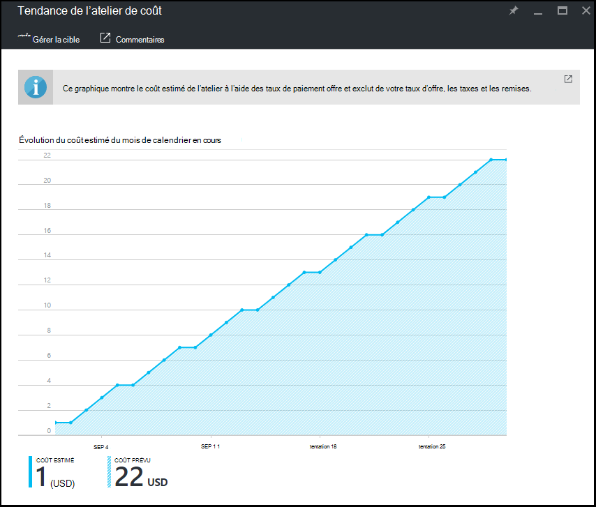

<properties
    pageTitle="Permet d’afficher la tendance de coût mensuel estimé lab dans Azure DevTest Labs | Microsoft Azure"
    description="Obtenir des informations sur le graphique de tendance Azure DevTest Labs mensuel coût estimé."
    services="devtest-lab,virtual-machines"
    documentationCenter="na"
    authors="tomarcher"
    manager="douge"
    editor=""/>

<tags
    ms.service="devtest-lab"
    ms.workload="na"
    ms.tgt_pltfrm="na"
    ms.devlang="na"
    ms.topic="article"
    ms.date="09/06/2016"
    ms.author="tarcher"/>

# Permet d’afficher la tendance de coût mensuel estimé lab dans Azure DevTest Labs

La fonctionnalité de gestion du coût de DevTest Labs vous permet de suivre le coût de votre laboratoire. Cet article illustre comment utiliser le plan **d’Évolution mensuelle du coût estimé** pour afficher coût-à-date estimée du mois actuel et le coût prévisionnel de la fin du mois pour le mois de calendrier en cours. Dans cet article, vous allez apprendre à afficher le graphique des tendances estimation du coût mensuel dans le portail Azure.

## Affichage du graphique de l’évolution du coût mensuel estimé

Pour afficher le graphique de l’évolution du coût mensuel estimé, procédez comme suit : 

1. Connectez-vous au [portail Azure](http://go.microsoft.com/fwlink/p/?LinkID=525040).

1. Sélectionnez **Plus de Services**et sélectionnez **DevTest Labs** à partir de la liste.

1. Dans la liste des laboratoires, sélectionnez l’atelier de votre choix.   

1. Sur les lames de l’atelier, sélectionnez **les paramètres de coût**.

1. Sur la lame de **paramètres de coût** de l’atelier, sélectionnez **l’évolution du coût de laboratoire**.

1. La capture d’écran suivante montre un exemple d’un graphique de coût. 

    

La valeur **du coût estimé** est coût-à-date estimée du mois actuel. Le **coût de prévision** est le coût estimé pour le mois de calendrier en cours entier, calculé à l’aide du coût du laboratoire des cinq jours précédents.
 
Les montants de coût sont arrondis au nombre entier suivant. Par exemple : 

- 5.01 arrondit jusqu'à 6 
- 5.50 arrondit jusqu'à 6
- 5.99 arrondit jusqu'à 6

Comme il indique au-dessus du graphique, les coûts que vous le consultez dans le graphique sont les coûts *estimés* à l’aide de [paiement](https://azure.microsoft.com/offers/ms-azr-0003p/) offrent des taux.
En outre, les éléments suivants sont *pas* inclus dans le calcul des coûts :

- Fournisseur de services cryptographiques et Dreamspark les abonnements sont actuellement pas prises en charge Azure DevTest Labs utilise les [API de facturation Azure](../billing-usage-rate-card-overview.md) pour calculer le coût de l’atelier, qui ne gère pas les abonnements de fournisseur de services cryptographiques ou Dreamspark.
- Taux de votre offre. Actuellement, nous ne sommes pas en mesure d’utiliser votre taux offre (affichée sous votre abonnement) que vous avez négocié avec Microsoft ou Microsoft partenaires. Nous utilisons le taux de paiement.
- Vos impôts
- Vos remises
- Devise de facturation. Actuellement, le coût du laboratoire s’affiche uniquement dans la devise USD.

[AZURE.INCLUDE [devtest-lab-try-it-out](../../includes/devtest-lab-try-it-out.md)]

## Publications de blogs connexes

- [Deux choses à conserver votre coût sur piste dans les laboratoires DevTest](https://blogs.msdn.microsoft.com/devtestlab/2016/06/21/keep-your-cost-on-track/)
- [Pourquoi les seuils de coût ?](https://blogs.msdn.microsoft.com/devtestlab/2016/04/11/why-cost-thresholds/)

## Étapes suivantes

Voici quelques conseils suivant :

- [Définir les stratégies de laboratoire](./devtest-lab-set-lab-policy.md) - apprendre à définir les différentes stratégies utilisées pour déterminer comment votre laboratoire et ses machines virtuelles sont utilisées. 
- [Créer une image personnalisée](./devtest-lab-create-template.md) - lorsque vous créez un ordinateur virtuel, vous spécifiez une base, qui peut être soit une image personnalisée ou un Marketplace. Cet article explique comment créer une image personnalisée à partir d’un fichier de disque dur virtuel.
- [Configurer le Marketplace images](./devtest-lab-configure-marketplace-images.md) - DevTest Labs prend en charge la création d’ordinateurs virtuels basés sur des images d’Azure Marketplace. Cet article explique comment spécifier qui, le cas échéant, les images d’Azure Marketplace peuvent être utilisé lors de la création d’ordinateurs virtuels dans un laboratoire.
- [Créer un ordinateur virtuel dans un laboratoire](./devtest-lab-add-vm-with-artifacts.md) - illustre comment créer un ordinateur virtuel à partir d’une image de base (soit personnalisé ou Marketplace) et l’utilisation des artefacts dans votre machine virtuelle.