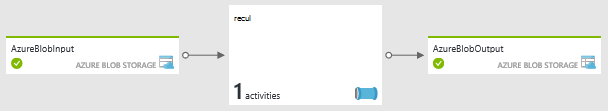
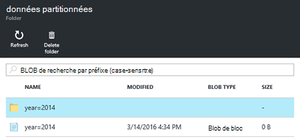
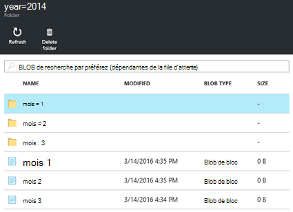

<properties
   pageTitle="Créer les clusters basés sur Linux de Hadoop sur demande dans HDInsight à l’aide de la fabrique de données Azure | Microsoft Azure"
    description="Apprenez à créer des clusters de HDInsight à la demande à l’aide de la fabrique de données Azure."
   services="hdinsight"
   documentationCenter=""
   tags="azure-portal"
   authors="mumian"
   manager="jhubbard"
   editor="cgronlun"/>

<tags
   ms.service="hdinsight"
   ms.devlang="na"
   ms.topic="article"
   ms.tgt_pltfrm="na"
   ms.workload="big-data"
   ms.date="10/06/2016"
   ms.author="jgao"/>

# Créer les clusters basés sur Linux de Hadoop sur demande dans HDInsight à l’aide de la fabrique de données Azure

[AZURE.INCLUDE [selector](../../includes/hdinsight-selector-create-clusters.md)]

[Azure Data Factory](../data-factory/data-factory-introduction.md) est un service d’intégration de données basé sur le cloud qui orchestre et automatise le déplacement et la transformation des données. Dans cet article, vous apprendrez comment Azure Data Factory à la création d’un [service lié à la demande de HDInsight d’Azure](../data-factory/data-factory-compute-linked-services.md#azure-hdinsight-on-demand-linked-service)et permet d’exécuter une tâche de la ruche du cluster. Voici le flux de haut niveau :

1. Créer une HDInsight cluster à la demande.
2. Exécuter une tâche de la ruche à lire les données de journal web brut à partir d’un compte de stockage de blob source, transformer les données et l’écriture de la sortie vers un compte de stockage de blob de destination. 
3. Supprimer le cluster basé sur le paramètre de durée de vie.

L’activité de la ruche définies dans les appels de pipeline de données fabrique un script HiveQL prédéfini. Le script crée une table externe qui fait référence aux données de journal web brutes stockées dans le stockage Azure Blob et les données brutes des partitions puis par année et mois.

Voici les exemples de lignes pour chaque mois dans le fichier d’entrée.

    2014-01-01,02:01:09,SAMPLEWEBSITE,GET,/blogposts/mvc4/step2.png,X-ARR-LOG-ID=2ec4b8ad-3cf0-4442-93ab-837317ece6a1,80,-,1.54.23.196,Mozilla/5.0+(Windows+NT+6.3;+WOW64)+AppleWebKit/537.36+(KHTML,+like+Gecko)+Chrome/31.0.1650.63+Safari/537.36,-,http://weblogs.asp.net/sample/archive/2007/12/09/asp-net-mvc-framework-part-4-handling-form-edit-and-post-scenarios.aspx,\N,200,0,0,53175,871 
    2014-02-01,02:01:10,SAMPLEWEBSITE,GET,/blogposts/mvc4/step7.png,X-ARR-LOG-ID=d7472a26-431a-4a4d-99eb-c7b4fda2cf4c,80,-,1.54.23.196,Mozilla/5.0+(Windows+NT+6.3;+WOW64)+AppleWebKit/537.36+(KHTML,+like+Gecko)+Chrome/31.0.1650.63+Safari/537.36,-,http://weblogs.asp.net/sample/archive/2007/12/09/asp-net-mvc-framework-part-4-handling-form-edit-and-post-scenarios.aspx,\N,200,0,0,30184,871
    2014-03-01,02:01:10,SAMPLEWEBSITE,GET,/blogposts/mvc4/step7.png,X-ARR-LOG-ID=d7472a26-431a-4a4d-99eb-c7b4fda2cf4c,80,-,1.54.23.196,Mozilla/5.0+(Windows+NT+6.3;+WOW64)+AppleWebKit/537.36+(KHTML,+like+Gecko)+Chrome/31.0.1650.63+Safari/537.36,-,http://weblogs.asp.net/sample/archive/2007/12/09/asp-net-mvc-framework-part-4-handling-form-edit-and-post-scenarios.aspx,\N,200,0,0,30184,871

Le script crée trois dossiers de sortie en fonction de l’entrée précédente. Chaque dossier contient un fichier avec des entrées de chaque mois.

    adfgetstarted/partitioneddata/year=2014/month=1/000000_0
    adfgetstarted/partitioneddata/year=2014/month=2/000000_0
    adfgetstarted/partitioneddata/year=2014/month=3/000000_0

Pour obtenir une liste des activités de transformation de données Data Factory en plus de l’activité de la ruche, consultez [transformation et l’analyser à l’aide de la fabrique de données Azure](../data-factory/data-factory-data-transformation-activities.md).

Il existe de nombreux avantages à l’utilisation de HDInsight avec la fabrique de données :

- Les clusters HDInsight de facturation est proportionnel par minute, que vous les utilisiez ou pas. À l’aide de la fabrique de données, les clusters sont créés à la demande. Et les clusters sont supprimés automatiquement lorsque les tâches sont terminées.  Par conséquent, vous ne payez que pour le travail en cours d’exécution la courte durée d’inactivité et de temps (time-to-live).
- Vous pouvez créer un flux de travail à l’aide du pipeline de Data Factory.
- Vous pouvez planifier des travaux de récursive.  

> [AZURE.NOTE] Actuellement, vous ne pouvez créer des HDInsight de basé sur Linux version de cluster 3.2 d’Azure Data Factory.

##Conditions préalables :

Avant de commencer les instructions de cet article, vous devez disposer des éléments suivants :

- [Abonnement azure](https://azure.microsoft.com/documentation/videos/get-azure-free-trial-for-testing-hadoop-in-hdinsight/).
- Azure CLI ou PowerShell Azure. 

    [AZURE.INCLUDE [use-latest-version](../../includes/hdinsight-use-latest-powershell-and-cli.md)]

##Préparer compte de stockage

Dans ce cas, vous pouvez utiliser jusqu'à trois comptes de stockage :

- compte de stockage par défaut pour le cluster HDInsight
- compte de stockage pour les données d’entrée
- compte de stockage pour les données de sortie

Pour simplifier le didacticiel, vous utilisez un compte de stockage pour servir les trois objectifs. La CLI d’Azure et un exemple de script PowerShell d’Azure dans cette section les tâches suivantes :

1. Ouvrez une session Azure.
2. Créer un groupe de ressources Azure.
3. Créez un compte de stockage Azure.
4. Créer un conteneur Blob sur le compte de stockage
5. Copiez les deux fichiers suivants dans le conteneur d’objet Blob :

    - Fichier de données d’entrée : [https://hditutorialdata.blob.core.windows.net/adfhiveactivity/inputdata/input.log](https://hditutorialdata.blob.core.windows.net/adfhiveactivity/inputdata/input.log)
    - Script de HiveQL : [https://hditutorialdata.blob.core.windows.net/adfhiveactivity/script/partitionweblogs.hql](https://hditutorialdata.blob.core.windows.net/adfhiveactivity/script/partitionweblogs.hql)

    Les deux fichiers sont stockés dans un conteneur d’objet Blob public. 

>[AZURE.IMPORTANT] Notez le nom du groupe ressources, le nom de compte de stockage et la clé de compte de stockage utilisée dans votre script.  Vous en aurez besoin dans la section suivante.

**Pour préparer le stockage et copier les fichiers à l’aide de la CLI d’Azure**

    azure login
    
    azure config mode arm

    azure group create --name "<Azure Resource Group Name>" --location "East US 2"

    azure storage account create --resource-group "<Azure Resource Group Name>" --location "East US 2" --type "LRS" <Azure Storage Account Name>

    azure storage account keys list --resource-group "<Azure Resource Group Name>" "<Azure Storage Account Name>"
    azure storage container create "adfgetstarted" --account-name "<Azure Storage AccountName>" --account-key "<Azure Storage Account Key>"

    azure storage blob copy start "https://hditutorialdata.blob.core.windows.net/adfhiveactivity/inputdata/input.log" --dest-account-name "<Azure Storage Account Name>" --dest-account-key "<Azure Storage Account Key>" --dest-container "adfgetstarted" 
    azure storage blob copy start "https://hditutorialdata.blob.core.windows.net/adfhiveactivity/script/partitionweblogs.hql" --dest-account-name "<Azure Storage Account Name>" --dest-account-key "<Azure Storage Account Key>" --dest-container "adfgetstarted" 

Le nom du conteneur est *adfgetstarted*.  Conserver tel quel. Dans le cas contraire, vous devez mettre à jour le modèle de gestion des ressources.

Si vous avez besoin d’aide avec ce script CLI, reportez-vous [à l’aide de la CLI Azure avec stockage Azure](../storage/storage-azure-cli.md).

**Pour préparer le stockage et copier les fichiers à l’aide de PowerShell d’Azure**

    $resourceGroupName = "<Azure Resource Group Name>"
    $storageAccountName = "<Azure Storage Account Name>"
    $location = "East US 2"

    $sourceStorageAccountName = "hditutorialdata"  
    $sourceContainerName = "adfhiveactivity"

    $destStorageAccountName = $storageAccountName
    $destContainerName = "adfgetstarted" # don't change this value.

    ####################################
    # Connect to Azure
    ####################################
    #region - Connect to Azure subscription
    Write-Host "`nConnecting to your Azure subscription ..." -ForegroundColor Green
    try{Get-AzureRmContext}
    catch{Login-AzureRmAccount}
    #endregion

    ####################################
    # Create a resource group, storage, and container
    ####################################

    #region - create Azure resources
    Write-Host "`nCreating resource group, storage account and blob container ..." -ForegroundColor Green

    New-AzureRmResourceGroup -Name $resourceGroupName -Location $location 
    New-AzureRmStorageAccount `
        -ResourceGroupName $resourceGroupName `
        -Name $destStorageAccountName `
        -type Standard_LRS `
        -Location $location 

    $destStorageAccountKey = (Get-AzureRmStorageAccountKey `
        -ResourceGroupName $resourceGroupName `
        -Name $destStorageAccountName)[0].Value

    $sourceContext = New-AzureStorageContext `
        -StorageAccountName $sourceStorageAccountName `
        -Anonymous
    $destContext = New-AzureStorageContext `
        -StorageAccountName $destStorageAccountName `
        -StorageAccountKey $destStorageAccountKey

    New-AzureStorageContainer -Name $destContainerName -Context $destContext
    #endregion

    ####################################
    # Copy files
    ####################################
    #region - copy files
    Write-Host "`nCopying files ..." -ForegroundColor Green

    $blobs = Get-AzureStorageBlob `
        -Context $sourceContext `
        -Container $sourceContainerName 

    $blobs|Start-AzureStorageBlobCopy `
        -DestContext $destContext `
        -DestContainer $destContainerName

    Write-Host "`nCopied files ..." -ForegroundColor Green
    Get-AzureStorageBlob -Context $destContext -Container $destContainerName 
    #endregion

    Write-host "`nYou will use the following values:" -ForegroundColor Green
    write-host "`nResource group name: $resourceGroupName"
    Write-host "Storage Account Name: $destStorageAccountName"
    write-host "Storage Account Key: $destStorageAccountKey"

    Write-host "`nScript completed" -ForegroundColor Green

Si vous avez besoin d’aide avec ce script PowerShell, reportez-vous [à l’aide de PowerShell Azure avec stockage Azure](../storage/storage-powershell-guide-full.md).

**Pour examiner le compte de stockage et le contenu**

1. Ouvrez une session sur le [portail Azure](https://portal.azure.com).
2. Dans le volet gauche, cliquez sur **groupes de ressources** .
3. Double-cliquez sur le nom du groupe de ressources créé dans votre script CLI ou PowerShell. Utilisez le filtre si vous avez trop de groupes de ressources répertoriées. 
4. Dans la fenêtre de **ressources** , vous aura une ressource répertoriée, sauf si vous partagez le groupe de ressources avec d’autres projets. Cette ressource est le compte de stockage avec le nom que vous avez spécifié précédemment. Cliquez sur le nom du compte de stockage.
5. Cliquez sur les **objets BLOB** de mosaïques.
6. Cliquez sur le conteneur **adfgetstarted** . Vous verrez deux dossiers : **script**et **données d’entrée** .
7. Ouvrez le dossier et les fichiers dans les dossiers.
 
## Création de la fabrique de données

Avec le compte de stockage, les données d’entrée et le script de HiveQL préparée, vous êtes prêt à créer une fabrique de données Azure. Il existe plusieurs méthodes pour la création de la fabrique de données. Le portail Azure vous permet d’appeler un modèle personnalisé de la gestion des ressources dans ce didacticiel. Vous pouvez également appeler le modèle de gestion des ressources à partir de la [CLI d’Azure](../resource-group-template-deploy.md#deploy-with-azure-cli-for-mac-linux-and-windows) et [d’Azure PowerShell](../resource-group-template-deploy.md#deploy-with-powershell). Pour les autres méthodes de création de factory de données, reportez-vous à la section [didacticiel : créer votre première fabrique de données](../data-factory/data-factory-build-your-first-pipeline.md).

Le modèle de gestion des ressources de niveau supérieur contient :

    {
        "contentVersion": "1.0.0.0",
        "$schema": "http://schema.management.azure.com/schemas/2015-01-01/deploymentTemplate.json#",
        "parameters": { ...
        },
        "variables": { ...
        },
        "resources": [
            {
                "name": "[parameters('dataFactoryName')]",
                "apiVersion": "[variables('apiVersion')]",
                "type": "Microsoft.DataFactory/datafactories",
                "location": "westus",
                "resources": [
                    { ... },
                    { ... },
                    { ... },
                    { ... }
                ]
            }
        ]
    }

Il contient une ressource d’usine de données appelée *hdinsight-ruche-à la demande* (le nom ne figure pas sur la capture d’écran). Usine de données est actuellement pris en charge uniquement dans la région ouest et la région Europe du Nord. 

La ressource *hdinsight-ruche-à la demande* contient quatre ressources :

- Un linkedservice pour le compte de stockage qui est utilisé comme compte de stockage par défaut HDInsight, stockage de données d’entrée et stockage des données de sortie.
- Un linkedservice au cluster HDInsight à créer :

        {
            "dependsOn": [ ... ],
            "type": "linkedservices",
            "name": "[variables('hdInsightOnDemandLinkedServiceName')]",
            "apiVersion": "[variables('apiVersion')]",
            "properties": {
                "type": "HDInsightOnDemand",
                "typeProperties": {
                    "osType": "linux",
                    "version": "3.2",
                    "clusterSize": 1,
                    "sshUserName": "myuser",                            
                    "sshPassword": "MyPassword!",
                    "timeToLive": "00:30:00",
                    "linkedServiceName": "[variables('storageLinkedServiceName')]"
                }
            }
        },

    Même si elle n’est pas spécifiée, le cluster est créé dans la même région que le compte de stockage.
    
    Notez le paramètre de *la propriété timeToLive* . Le factory de données supprime automatiquement le cluster une fois que le cluster est inactif pendant 30 minutes.
- Un groupe de données pour les données d’entrée. Le nom de fichier et le nom de dossier sont définies ici :

        "fileName": "input.log",
        "folderPath": "adfgetstarted/inputdata",
        
- Un groupe de données pour les données de sortie et tuyau pour le traitement des données. Le chemin de sortie est défini ici :
        
        "folderPath": "adfgetstarted/partitioneddata",

    Le paramètre de [disponibilité du groupe de données](../data-factory/data-factory-create-datasets.md#Availability) est la suivante :
    
        "availability": {
            "frequency": "Month",
            "interval": 1,
            "style": "EndOfInterval"
        },

    Dans Azure Data Factory, disponibilité de dataset de sortie lecteurs du pipeline. Cela signifie que la section est générée tous les mois sur le dernier jour du mois. Pour plus d’informations, consultez [planification de fabrique de données et l’exécution](../data-factory/data-factory-scheduling-and-execution.md).

    La définition de pipeline est la suivante :
    
        {
            "dependsOn": [ ... ],
            "type": "datapipelines",
            "name": "[parameters('dataFactoryName')]",
            "apiVersion": "[variables('apiVersion')]",
            "properties": {
                "description": "Azure Data Factory pipeline with an Hadoop Hive activity",
                "activities": [
                    { ...}
                ],
                "start": "2016-01-01T00:00:00Z",
                "end": "2016-01-31T00:00:00Z",
                "isPaused": false
            }
        }
                
    Il contient une seule activité. *Début* et la *fin* de l’activité ont une date passée, ce qui signifie qu’il existe un seul secteur. Si la terminaison est une date future, le factory de données crée une autre tranche, le moment venu. Pour plus d’informations, consultez [planification de fabrique de données et l’exécution](../data-factory/data-factory-scheduling-and-execution.md).

    Le script suivant de Json est la définition d’activité :
    
        "activities": [
            {
                "type": "HDInsightHive",
                "typeProperties": {
                    "scriptPath": "adfgetstarted/script/partitionweblogs.hql",
                    "scriptLinkedService": "[variables('storageLinkedServiceName')]",
                    "defines": {
                        "inputtable": "[concat('wasbs://adfgetstarted@', parameters('storageAccountName'), '.blob.core.windows.net/inputdata')]",
                        "partitionedtable": "[concat('wasbs://adfgetstarted@', parameters('storageAccountName'), '.blob.core.windows.net/partitioneddata')]"
                    }
                },
                "inputs": [
                    {
                        "name": "AzureBlobInput"
                    }
                ],
                "outputs": [
                    {
                        "name": "AzureBlobOutput"
                    }
                ],
                "policy": {
                    "concurrency": 1,
                    "retry": 3
                },
                "name": "RunSampleHiveActivity",
                "linkedServiceName": "HDInsightOnDemandLinkedService"
            }
        ],
    
    Le chemin d’accès du script, les entrées et sorties sont définis.
    
**Pour créer une fabrique de données**

1. Cliquez sur l’image suivante pour vous connecter à Azure et ouvrez le modèle de gestion des ressources dans le portail Azure. Le modèle se trouve dans https://hditutorialdata.blob.core.windows.net/adfhiveactivity/data-factory-hdinsight-on-demand.json. 

    

2. Entrez **DATAFACTORYNAME**, **STORAGEACCOUNTNAME** et **STORAGEACCOUNTKEY** pour le compte que vous avez créé dans la dernière section, puis cliquez sur **OK**. Nom d’usine de données doit être globalement unique.
3. Dans le **Groupe de ressources**, sélectionnez le même groupe de ressources que vous avez utilisée dans la dernière section.
4. Cliquez sur **conditions**, puis cliquez sur **créer**.
5. Cliquez sur **créer**. Vous consultez une mosaïque sur le tableau de bord appelé de **déploiement de modèle de déploiement**. Attendez que le texte de la mosaïque est remplacé par le nom de groupe de ressources. Elle prend généralement environ 20 minutes pour créer un cluster de HDInsight.
6. Cliquez sur la mosaïque pour ouvrir le groupe de ressources. Maintenant vous veillent à une ressource en usine données plus répertoriée en plus de la ressource de compte de stockage.
7. Cliquez sur **hdinsight-ruche-à la demande**.
8. Cliquez sur la mosaïque du **diagramme** . Le diagramme montre une activité avec un groupe de données d’entrée et de sortie d’un groupe de données :

    
    
    Les noms sont définis dans le modèle de gestion des ressources.
9. Double-cliquez sur **AzureBlobOutput**.
10. Sur le **récent mis à jour les tranches**, vous veillent à une tranche. Si le statut est **en cours**, patientez jusqu'à ce qu’il est modifié en **prêt**.

**Pour vérifier la sortie d’usine de données**

1. Utilisez la même procédure dans la session précédente pour vérifier les conteneurs du conteneur adfgetstarted. Il existe deux nouveaux conteneurs en plus de **adfgetsarted**:

    - adfhdinsight-Hive-on-Demand-hdinsightondemandlinked-xxxxxxxxxxxxx : il s’agit du conteneur par défaut pour l’HDInsight du cluster. Nom de conteneur par défaut suit le modèle : « CAD<yourdatafactoryname>- linkedservicename-datetimestamp ». 
    - adfjobs : il s’agit du conteneur pour les journaux de travail du CAD.
    
    La sortie d’usine de données est stockée dans afgetstarted que vous avez configuré dans le modèle de gestion des ressources. 
2. Cliquez sur **adfgetstarted**.
3. Double-cliquez sur **partitioneddata**. Vous verrez un **année = 2014** dossier parce que tous les journaux web sont datées en année 2014. 

    

    Si vous affichez la liste vers le bas, vous veillent trois dossiers pour janvier, février et mars. Et il existe un journal pour chaque mois.

    

##Nettoyage du didacticiel

Avec le service de HDInsight liée à la demande, un cluster de HDInsight est créé chaque fois qu’une tranche doit être traité sauf s’il existe un cluster live existant (la propriété timeToLive) ; et le cluster est supprimé lorsque le traitement est terminé. Pour chaque cluster, Azure Data Factory crée un stockage blob Azure utilisé comme système de fichiers par défaut pour le cluster.  Bien que le cluster de HDInsight est supprimé, le conteneur de stockage blob par défaut et le compte de stockage associé ne sont pas supprimés. Cela est voulu par la conception. Comme plusieurs sections sont traitées, vous voyez beaucoup de conteneurs dans le stockage blob Azure. Si vous ne devez pas les pour des tâches de dépannage, vous souhaiterez les supprimer afin de réduire le coût de stockage. Les noms de ces conteneurs obéissent à un modèle : « adfyourdatafactoryname-linkedservicename-datetimestamp ». 

[Azure le Gestionnaire de ressources](../azure-resource-manager/resource-group-overview.md) est utilisé pour déployer, gérer et surveiller votre solution en tant que groupe.  Suppression d’un groupe de ressources supprimera tous les composants à l’intérieur du groupe.  

**Pour supprimer le groupe de ressources**

1. Ouvrez une session sur le [portail Azure](https://portal.azure.com).
2. Dans le volet gauche, cliquez sur **groupes de ressources** .
3. Double-cliquez sur le nom du groupe de ressources créé dans votre script CLI ou PowerShell. Utilisez le filtre si vous avez trop de groupes de ressources répertoriées. Il ouvre le groupe de ressources dans une nouvelle lame.
4. Dans la fenêtre de **ressources** , vous a le compte de stockage par défaut et le factory de données énumérées, sauf si vous partagez le groupe de ressources avec d’autres projets.
5. Cliquez sur **Supprimer** en haut de la lame. Ce faisant, vous supprimez également le compte de stockage et les données stockées dans le compte de stockage.
6. Entrez le nom de groupe de ressources, puis cliquez sur **Supprimer**.

Dans le cas où vous ne souhaitez pas supprimer le compte de stockage lorsque vous supprimez le groupe de ressources, vous pouvez envisager la conception de l’architecture suivante en séparant les données d’entreprise à partir du compte de stockage par défaut. Dans ce cas, vous aurez un groupe de ressources pour le compte de stockage avec les données d’entreprise et le groupe de ressources pour le compte de stockage par défaut et le factory de données.  Lorsque vous supprimez le deuxième groupe de ressources, elle n’aura aucun impact sur le compte de stockage de données métier.  Pour ce faire : 

- Ajoutez le code suivant le groupe de ressources de niveau supérieur avec la ressource Microsoft.DataFactory/datafactories dans votre modèle de gestion des ressources. Il crée un nouveau compte de stockage :

        {
            "name": "[parameters('defaultStorageAccountName')]",
            "type": "Microsoft.Storage/storageAccounts",
            "location": "[parameters('location')]",
            "apiVersion": "[variables('defaultApiVersion')]",
            "dependsOn": [ ],
            "tags": {

            },
            "properties": {
                "accountType": "Standard_LRS"
            }
        },

- Ajouter un nouveau point de service lié au nouveau compte de stockage :

        {
            "dependsOn": [ "[concat('Microsoft.DataFactory/dataFactories/', parameters('dataFactoryName'))]" ],
            "type": "linkedservices",
            "name": "[variables('defaultStorageLinkedServiceName')]",
            "apiVersion": "[variables('apiVersion')]",
            "properties": {
                "type": "AzureStorage",
                "typeProperties": {
                    "connectionString": "[concat('DefaultEndpointsProtocol=https;AccountName=',parameters('defaultStorageAccountName'),';AccountKey=',listKeys(resourceId('Microsoft.Storage/storageAccounts', variables('defaultStorageAccountName')), variables('defaultApiVersion')).key1)]"
                }
            }
        },
    
- Configurer le service lié à la demande de HDInsight avec un dependsOn supplémentaire et une additionalLinkedServiceNames :

        {
            "dependsOn": [
                "[concat('Microsoft.DataFactory/dataFactories/', parameters('dataFactoryName'))]",
                "[concat('Microsoft.DataFactory/dataFactories/', parameters('dataFactoryName'), '/linkedservices/', variables('defaultStorageLinkedServiceName'))]",
                "[concat('Microsoft.DataFactory/dataFactories/', parameters('dataFactoryName'), '/linkedservices/', variables('storageLinkedServiceName'))]"
                
            ],
            "type": "linkedservices",
            "name": "[variables('hdInsightOnDemandLinkedServiceName')]",
            "apiVersion": "[variables('apiVersion')]",
            "properties": {
                "type": "HDInsightOnDemand",
                "typeProperties": {
                    "osType": "linux",
                    "version": "3.2",
                    "clusterSize": 1,
                    "sshUserName": "myuser",                            
                    "sshPassword": "MyPassword!",
                    "timeToLive": "00:30:00",
                    "linkedServiceName": "[variables('storageLinkedServiceName')]",
                    "additionalLinkedServiceNames": "[variables('defaultStorageLinkedServiceName')]"
                }
            }
        },            

##Étapes suivantes
Dans cet article, vous avez appris comment utiliser le Factory de données Azure pour créer le cluster de HDInsight à la demande pour traiter les travaux de la ruche. Pour en savoir plus :

- [Hadoop didacticiel : mise en route de basé sur Linux de Hadoop dans HDInsight](hdinsight-hadoop-linux-tutorial-get-started.md)
- [Créer les clusters basés sur Linux de Hadoop dans HDInsight](hdinsight-hadoop-provision-linux-clusters.md)
- [Documentation de HDInsight](https://azure.microsoft.com/documentation/services/hdinsight/)
- [Documentation de fabrique de données](https://azure.microsoft.com/documentation/services/data-factory/)

