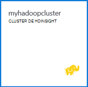

<properties
   pageTitle="Hadoop didacticiel : mise en route de Hadoop sur Windows | Microsoft Azure"
   description="Mise en route avec Hadoop dans HDInsight. Apprenez à créer des clusters d’Hadoop sur Windows, exécuter une requête de ruche sur des données et analyser la sortie dans Excel."
   keywords="didacticiel Hadoop, hadoop sur windows, hadoop cluster, découvrez hadoop, requête de ruche"
   services="hdinsight"
   documentationCenter=""
   authors="nitinme"
   manager="jhubbard"
   editor="cgronlun"
   tags="azure-portal"/>

<tags
   ms.service="hdinsight"
   ms.devlang="na"
   ms.topic="article"
   ms.tgt_pltfrm="na"
   ms.workload="big-data"
   ms.date="03/07/2016"
   ms.author="nitinme"/>

# Hadoop didacticiel : mise en route à l’aide d’Hadoop dans HDInsight sous Windows

> [AZURE.SELECTOR]
- [Basé sur Linux](../hdinsight-hadoop-linux-tutorial-get-started.md)
- [Basé sur Windows](../hdinsight-hadoop-tutorial-get-started-windows.md)

Pour vous aider à en savoir Hadoop sur Windows et démarrer à l’aide de HDInsight, ce didacticiel vous montre comment exécuter une requête de ruche sur des données non structurées dans un cluster Hadoop et analyser les résultats dans Microsoft Excel.

>[AZURE.NOTE] Les informations contenues dans ce document sont spécifiques aux clusters de HDInsight de basées sur Windows. Pour plus d’informations sur les clusters basés sur Linux, consultez [Hadoop didacticiel : mise en route de basé sur Linux de Hadoop dans HDInsight](hdinsight-hadoop-linux-tutorial-get-started.md).

Supposons que vous disposez d’un grand ensemble de données non structuré et à exécuter une requête de ruche sur lui pour extraire des informations utiles. C’est exactement ce que vous allez faire dans ce didacticiel. Voici comment obtenir ce résultat :

   ![« Hadoop didacticiel : création d’un compte ; créer un cluster Hadoop ; soumettre une requête de la ruche ; analyser les données dans Excel.][image-hdi-getstarted-flow]

Regarder une vidéo de démonstration de ce didacticiel pour apprendre Hadoop sur HDInsight :

![Vidéo d’un premier didacticiel Hadoop : soumettre une requête de ruche sur un cluster Hadoop et analyser les résultats dans Excel.][img-hdi-getstarted-video]

**[Visionnez le didacticiel Hadoop pour HDInsight sur YouTube](https://www.youtube.com/watch?v=Y4aNjnoeaHA&list=PLDrz-Fkcb9WWdY-Yp6D4fTC1ll_3lU-QS)**

Conjointement avec la disponibilité générale de HDInsight d’Azure, Microsoft fournit également un émulateur HDInsight pour Azure, anciennement appelé *Microsoft HDInsight Developer Preview*. L’émulateur cible des scénarios types de développeur et prend uniquement en charge les déploiements à un seul nœud. Pour plus d’informations sur l’utilisation de HDInsight émulateur, consultez [Mise en route de l’émulateur HDInsight][hdinsight-emulator].

[AZURE.INCLUDE [delete-cluster-warning](../../includes/hdinsight-delete-cluster-warning.md)]

## Conditions préalables

Avant de commencer ce didacticiel pour Hadoop sur Windows, vous devez disposer des éléments suivants :

- **Abonnement d’un Azure**. Consultez [Azure d’obtenir la version d’évaluation gratuite](https://azure.microsoft.com/documentation/videos/get-azure-free-trial-for-testing-hadoop-in-hdinsight/).
- **Une station de travail** avec Office 2013 Professionnel Plus, Office 365 Pro Plus, Excel 2013 autonome ou Office 2010 Professionnel Plus.

### Exigences de contrôle d’accès

[AZURE.INCLUDE [access-control](../../includes/hdinsight-access-control-requirements.md)]

##Créer des clusters d’Hadoop

Lorsque vous créez un cluster, vous créez des ressources de calcul Azure contenant Hadoop et les applications associées. Dans cette section, vous créez un cluster de version 3.2 HDInsight. Vous pouvez également créer des clusters d’Hadoop pour d’autres versions. Pour obtenir des instructions, voir [clusters de HDInsight de créer à l’aide des options personnalisées][hdinsight-provision]. Pour plus d’informations sur les versions de HDInsight et leurs contrats SLA, consultez [Versioning des composants de HDInsight](hdinsight-component-versioning.md).

**Pour créer un cluster Hadoop**

1. Connectez-vous au [portail Azure](https://portal.azure.com/).
2. Cliquez sur **Nouveau**et cliquez sur **Données Analytique**, puis cliquez sur **HDInsight**. Le portail ouvre une lame de **Nouveau HDInsight Cluster** .

    ![Créer un nouveau cluster dans le portail Azure] (./media/hdinsight-hadoop-tutorial-get-started-windows/HDI.CreateCluster.1.png "Créer un nouveau cluster dans le portail Azure")

3. Entrez ou sélectionnez le des options suivantes :

    ![Type et entrez le nom de cluster] (./media/hdinsight-hadoop-tutorial-get-started-windows/HDI.CreateCluster.2.png "Type et entrez le nom de cluster")
    
  	|Nom de champ| Valeur|
  	|----------|------|
  	|Nom du cluster| Un nom unique pour identifier le cluster|
  	|Type de cluster| Sélectionnez **Hadoop** pour ce didacticiel. |
  	|Système d’exploitation en cluster| Sélectionnez **Windows Server 2012 R2 Datacenter** pour ce didacticiel.|
  	|Version de HDInsight| Sélectionnez la version la plus récente de ce didacticiel.|
  	|Abonnement| Sélectionnez l’abonnement Azure qui sera utilisé pour le cluster.|
  	|Groupe de ressources | Sélectionnez un groupe de ressources Azure existant ou créer un nouveau groupe de ressources. Un cluster de base HDInsight contient un cluster et son compte de stockage par défaut.  Vous pouvez regrouper les deux dans un groupe de ressources pour faciliter la gestion.|
  	|Informations d’identification| Entrez le nom de connexion de cluster et le mot de passe. Cluster de base de Windows peut avoir 2 comptes d’utilisateurs.  L’utilisateur de cluster (ou utilisateur HTTP) est utilisé pour gérer le cluster et de soumettre des travaux.  Vous pouvez également créer un bureau à distance (RDP) compte d’utilisateur distant de se connecter au cluster. Si vous choisissez d’activer le Bureau à distance, vous allez créer le compte d’utilisateur RDP.|
  	|Source de données| Cliquez sur Créer pour créer un nouveau compte de stockage Azure par défaut. Le nom de conteneur par défaut, utilisez le nom du cluster. Chaque cluster HDinsight a un conteneur d’objet Blob par défaut sur un compte de stockage Azure.  L’emplacement du compte de stockage Azure par défaut détermine l’emplacement du cluster HDInsight.|
  	|Nœud de niveaux de prix| Utiliser 1 ou 2 nœuds de travail avec la note de tête et de nœud de travail par défaut niveau de tarification pour ce didacticiel.|
  	|Configuration facultative| Ignorer cette partie.|

9. Sur la lame de **Nouveau HDInsight Cluster** , assurez-vous que **broche à Startboard** est sélectionnée, puis cliquez sur **créer**. Cela crée le cluster et ajouter une mosaïque pour elle à la Startboard de votre portail d’Azure. L’icône indique que le cluster consiste à créer et change pour afficher l’icône de HDInsight une fois la création terminée.

  	| Lors de la création | Création terminée |
  	| ------------------ | --------------------- |
  	|  |  |

    > [AZURE.NOTE] Il prend un certain temps pour le cluster doit être créée, généralement environ 15 minutes. Utilisez la mosaïque sur le Startboard ou l’entrée de **Notifications** sur la gauche de la page pour vérifier sur le processus de création.

10. Une fois la création terminée, cliquez sur la mosaïque pour le cluster à partir de la Startboard pour lancer la lame du cluster.

## Exécuter une requête de la ruche à partir du portail
Maintenant que vous avez créé un cluster HDInsight, l’étape suivante est d’exécuter une tâche de la ruche pour interroger un exemple de table de ruche. Nous utilisons *hivesampletable*, qui est fourni avec les clusters HDInsight. La table contient des données sur les fabricants de périphériques mobiles, de plates-formes et de modèles. Une requête de ruche sur cette table extrait des données pour les périphériques mobiles d’un fabricant spécifique.

> [AZURE.NOTE] Outils HDInsight pour Visual Studio est fourni avec le SDK Azure pour .NET version 2.5 ou ultérieure. En utilisant les outils dans Visual Studio, vous pouvez se connecter au cluster de HDInsight, créer des tables de la ruche et exécuter des requêtes de la ruche. Pour plus d’informations, consultez [mise en route à l’aide d’outils d’Hadoop HDInsight pour Visual Studio][1].

**Pour exécuter une tâche de la ruche à partir du tableau de bord du cluster**

1. Connectez-vous au [portail Azure](https://portal.azure.com/).
2. Cliquez sur **Rechercher tout** , puis sur **Clusters de HDInsight** pour afficher une liste des clusters, y compris le cluster que vous venez de créer dans la section précédente.
3. Cliquez sur le nom du cluster que vous souhaitez utiliser pour exécuter la tâche de la ruche, puis cliquez sur le **tableau de bord** dans la partie supérieure de la lame.
4. Une page Web s’ouvre dans un onglet du navigateur différent. Entrez le compte d’utilisateur Hadoop et le mot de passe. Le nom d’utilisateur par défaut est **admin**; le mot de passe est ce que vous avez entré lors de la création du cluster.
5. Dans le tableau de bord, cliquez sur l’onglet **Éditeur de la ruche** . La page web suivante s’ouvre.

    ![Onglet Éditeur dans le tableau de bord du cluster HDInsight la ruche.][img-hdi-dashboard]

    Il existe plusieurs onglets en haut de la page. L’onglet par défaut est **l’Éditeur de la ruche**et les autres onglets sont **L’historique du travail** et **l’Explorateur de fichiers**. En utilisant le tableau de bord, vous pouvez soumettre des requêtes de ruche, vérifiez les journaux de travail Hadoop et parcourir les fichiers dans le stockage.

    > [AZURE.NOTE] Notez que l’URL de la page Web est * &lt;ClusterName&gt;. azurehdinsight.net*. Ainsi, au lieu d’ouvrir le tableau de bord à partir du portail, vous pouvez ouvrir le tableau de bord à partir d’un navigateur web à l’aide de l’URL.

6. Sous l’onglet **Éditeur de la ruche** , **Nom de la requête**, entrez **HTC20**.  Le nom de la requête est le titre de la tâche. Dans le volet de requête, entrez la requête de la ruche, comme illustré dans l’image :

    ![Requête de la ruche dans le volet de requête de l’éditeur de la ruche.][img-hdi-dashboard-query-select]

4. Cliquez sur **Envoyer**. Il prend un certain temps à récupérer les résultats. L’écran s’actualise toutes les 30 secondes. Vous pouvez également cliquer sur **Actualiser** pour actualiser l’écran.

    ![Les résultats d’une requête de la ruche dans répertoriés au bas du tableau de bord de cluster.][img-hdi-dashboard-query-select-result]

5. Une fois que l’état indique que la tâche est terminée, cliquez sur le nom de la requête à l’écran pour voir le résultat. Prenez note du **Travail Démarrer heure UTC**. Vous en aurez besoin ultérieurement.

    ![Tâche de l’heure de début apparaît dans l’onglet Historique de travail du tableau de bord de cluster HDInsight.][img-hdi-dashboard-query-select-result-output]

    La page affiche également la **Sortie des tâches** et le **Journal de la tâche**. Vous avez également la possibilité de télécharger le fichier de sortie (\_stdout) et le fichier journal \(_stderr).

**Pour rechercher le fichier de sortie**

1. Dans le tableau de bord de cluster, cliquez sur **Explorateur de fichiers**.
2. Cliquez sur le nom de votre compte de stockage, cliquez sur votre nom de conteneur (qui est le même que votre nom de cluster), puis cliquez sur **utilisateur**.
3. Cliquez sur **admin** , puis cliquez sur le GUID qui a l’heure de dernière modification (un peu après la tâche de début précédemment notées). Copiez ce GUID. Vous en aurez besoin dans la section suivante.

    ![Fichier que GUID répertorié dans l’onglet Explorateur de fichiers de sortie de la requête de la ruche.][img-hdi-dashboard-query-browse-output]

##Se connecter à des outils d’analyse décisionnelle Microsoft Excel

Vous pouvez utiliser le complément de requête de la puissance de Microsoft Excel pour importer la sortie de projet à partir de HDInsight dans Excel, dans lequel les outils d’analyse décisionnelle Microsoft peuvent servir à analyser de manière approfondie les résultats.

Vous devez disposer de Excel 2013 ou 2010 est installé pour cette partie du didacticiel.

**Pour télécharger la puissance de Microsoft Query pour Excel**

- Télécharger Microsoft Query de puissance pour Microsoft Excel à partir du [Centre de téléchargement Microsoft](http://www.microsoft.com/download/details.aspx?id=39379) et l’installer.

**Pour importer des données de HDInsight**

1. Ouvrez Excel et créer un nouveau classeur.
3. Cliquez sur le menu de la **Requête de l’alimentation** , cliquez sur **à partir d’autres Sources**, puis cliquez sur **à partir de l’HDInsight Azure**.

    ![Menu d’importation de PowerQuery Excel ouvert pour Azure HDInsight.][image-hdi-gettingstarted-powerquery-importdata]

3. Entrez le **Nom de compte** du compte de stockage des objets Blob Azure qui est associé à votre cluster, puis cliquez sur **OK**. (Il s’agit du compte de stockage que vous avez créé précédemment dans le didacticiel).
4. Entrez la **Clé de compte** pour le compte de stockage des objets Blob Azure, puis cliquez sur **Enregistrer**.
5. Dans le volet droit, double-cliquez sur le nom de l’objet blob. Par défaut, le nom de l’objet blob est le même que le nom du cluster.

6. Dans la colonne **nom** , recherchez **stdout** . Vérifiez que le GUID dans la colonne **Chemin d’accès du dossier** correspondant correspond le GUID que vous avez copié précédemment. Une correspondance suggère que les données de sortie correspondant à la tâche que vous avez soumis. Cliquez sur **binaire** dans la colonne de gauche de **stdout**.

    ![Recherche les données produites par le GUID dans la liste de contenu.][image-hdi-gettingstarted-powerquery-importdata2]

9. Cliquez sur **Fermer et charge** , dans le coin supérieur gauche pour importer le travail de la ruche de sortie dans Excel.

##Exécution d’exemples

HDInsight cluster fournit une console de requête qui inclut une bibliothèque de mise en route pour exécuter les exemples directement à partir du portail. Vous pouvez utiliser les exemples pour apprendre à travailler avec HDInsight en progressant dans quelques scénarios de base. Ces exemples sont fournis avec tous les composants requis, tels que les données à analyser et les requêtes à exécuter sur les données. Pour en savoir plus sur les exemples de la bibliothèque de mise en route, consultez [Hadoop de savoir en HDInsight à l’aide de la galerie de route HDInsight mise en route](hdinsight-learn-hadoop-use-sample-gallery.md).

**Pour exécuter l’exemple**

1. À partir de la startboard Azure Portal, cliquez sur la mosaïque pour le cluster que vous venez de créer.
 
2. Dans la nouvelle blade de cluster, cliquez sur **tableau de bord**. Lorsque vous y êtes invité, entrez le nom d’utilisateur admin et le mot de passe pour le cluster.

    ![Lancer le tableau de bord de cluster] (./media/hdinsight-hadoop-tutorial-get-started-windows/HDI.Cluster.Dashboard.png "Lancer le tableau de bord de cluster")
 
3. À partir de la page Web qui s’ouvre, cliquez sur l’onglet **Mise en route présentation** et puis, dans la catégorie des **Solutions avec des exemples de données** , cliquez sur l’exemple que vous souhaitez exécuter. Suivez les instructions de la page Web à la fin de l’exemple. Le tableau suivant répertorie quelques exemples et fournit plus d’informations sur ce que chaque échantillon.

Exemple | Quel est son rôle ?
------ | ---------------
[Analyse des données de capteur][hdinsight-sensor-data-sample] | Découvrez comment utiliser HDInsight pour traiter les données historiques qui sont produites par chauffage, de ventilation et de systèmes de conditionnement d’air (HVAC) pour identifier les systèmes qui ne sont pas en mesure de manière fiable à maintenir une température de jeu.
[Analyse des journaux de site Web][hdinsight-weblogs-sample] | Découvrez comment utiliser HDInsight pour analyser les fichiers journaux de site Web pour obtenir un aperçu de la fréquence des visites sur le site Web d’un jour à partir des sites Web externes, ainsi qu’un résumé des erreurs de site Web auxquels les utilisateurs confrontés.
[Analyse des tendances Twitter](hdinsight-analyze-twitter-data.md) | Découvrez comment utiliser HDInsight pour analyser les tendances dans Twitter.

##Supprimer du cluster

[AZURE.INCLUDE [delete-cluster-warning](../../includes/hdinsight-delete-cluster-warning.md)]

##Étapes suivantes
Dans ce didacticiel Hadoop, vous avez appris comment créer un cluster Hadoop sur Windows dans HDInsight, exécuter une requête de ruche sur les données et importer les résultats dans Excel, où elles peuvent être traitement et affichent sous forme graphique avec les outils d’analyse décisionnelle. Pour plus d’informations, consultez les didacticiels suivants :

- [Mise en route à l’aide des outils d’Hadoop HDInsight pour Visual Studio][1]
- [Mise en route de l’émulateur HDInsight][hdinsight-emulator]
- [Utilisez le stockage des objets Blob Azure avec HDInsight][hdinsight-storage]
- [Administrer les HDInsight à l’aide de PowerShell][hdinsight-admin-powershell]
- [Téléchargement des données vers HDInsight][hdinsight-upload-data]
- [Utilisez MapReduce avec HDInsight][hdinsight-use-mapreduce]
- [Utilisez la ruche avec HDInsight][hdinsight-use-hive]
- [Utilisez des porcs avec HDInsight][hdinsight-use-pig]
- [Utiliser Oozie avec HDInsight][hdinsight-use-oozie]
- [Développer les programmes Java MapReduce pour HDInsight][hdinsight-develop-mapreduce]

[1]: ../HDInsight/hdinsight-hadoop-visual-studio-tools-get-started.md

[hdinsight-versions]: hdinsight-component-versioning.md

[hdinsight-provision]: hdinsight-provision-clusters.md
[hdinsight-admin-powershell]: hdinsight-administer-use-powershell.md
[hdinsight-upload-data]: hdinsight-upload-data.md
[hdinsight-use-mapreduce]: hdinsight-use-mapreduce.md
[hdinsight-use-hive]: hdinsight-use-hive.md
[hdinsight-use-pig]: hdinsight-use-pig.md
[hdinsight-use-oozie]: hdinsight-use-oozie.md
[hdinsight-storage]: hdinsight-hadoop-use-blob-storage.md
[hdinsight-emulator]: hdinsight-hadoop-emulator-get-started.md
[hdinsight-develop-mapreduce]: hdinsight-develop-deploy-java-mapreduce-linux.md
[hadoop-hdinsight-intro]: hdinsight-hadoop-introduction.md
[hdinsight-weblogs-sample]: hdinsight-hive-analyze-website-log.md
[hdinsight-sensor-data-sample]: hdinsight-hive-analyze-sensor-data.md

[azure-purchase-options]: http://azure.microsoft.com/pricing/purchase-options/
[azure-member-offers]: http://azure.microsoft.com/pricing/member-offers/
[azure-free-trial]: http://azure.microsoft.com/pricing/free-trial/
[azure-management-portal]: https://portal.azure.com/
[azure-create-storageaccount]: ../storage-create-storage-account.md

[apache-hadoop]: http://go.microsoft.com/fwlink/?LinkId=510084
[apache-hive]: http://go.microsoft.com/fwlink/?LinkId=510085
[apache-mapreduce]: http://go.microsoft.com/fwlink/?LinkId=510086
[apache-hdfs]: http://go.microsoft.com/fwlink/?LinkId=510087
[hdinsight-hbase-custom-provision]: hdinsight-hbase-tutorial-get-started.md

[powershell-download]: http://go.microsoft.com/fwlink/p/?linkid=320376&clcid=0x409
[powershell-install-configure]: powershell-install-configure.md
[powershell-open]: powershell-install-configure.md#step-1-install

[img-hdi-dashboard]: ./media/hdinsight-hadoop-tutorial-get-started-windows/HDI.dashboard.png
[img-hdi-dashboard-query-select]: ./media/hdinsight-hadoop-tutorial-get-started-windows/HDI.dashboard.query.select.png
[img-hdi-dashboard-query-select-result]: ./media/hdinsight-hadoop-tutorial-get-started-windows/HDI.dashboard.query.select.result.png
[img-hdi-dashboard-query-select-result-output]: ./media/hdinsight-hadoop-tutorial-get-started-windows/HDI.dashboard.query.select.result.output.png
[img-hdi-dashboard-query-browse-output]: ./media/hdinsight-hadoop-tutorial-get-started-windows/HDI.dashboard.query.browse.output.png

[img-hdi-getstarted-video]: ./media/hdinsight-hadoop-tutorial-get-started-windows/hdi-get-started-video.png

[image-hdi-storageaccount-quickcreate]: ./media/hdinsight-hadoop-tutorial-get-started-windows/HDI.StorageAccount.QuickCreate.png
[image-hdi-clusterstatus]: ./media/hdinsight-hadoop-tutorial-get-started-windows/HDI.ClusterStatus.png
[image-hdi-quickcreatecluster]: ./media/hdinsight-hadoop-tutorial-get-started-windows/HDI.QuickCreateCluster.png
[image-hdi-getstarted-flow]: ./media/hdinsight-hadoop-tutorial-get-started-windows/HDI.GetStartedFlow.png

[image-hdi-gettingstarted-powerquery-importdata]: ./media/hdinsight-hadoop-tutorial-get-started-windows/HDI.GettingStarted.PowerQuery.ImportData.png
[image-hdi-gettingstarted-powerquery-importdata2]: ./media/hdinsight-hadoop-tutorial-get-started-windows/HDI.GettingStarted.PowerQuery.ImportData2.png
 
